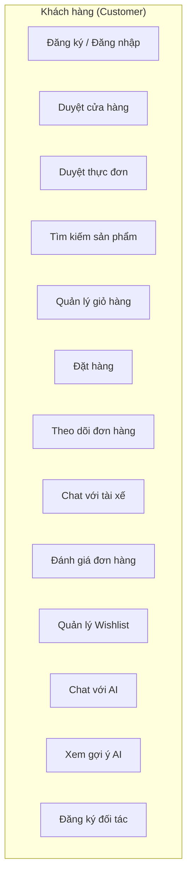
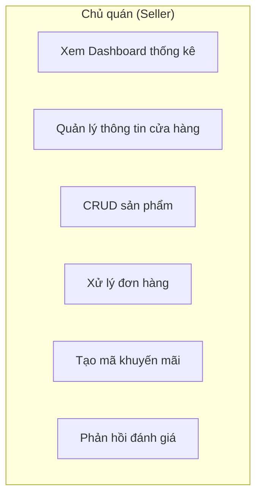
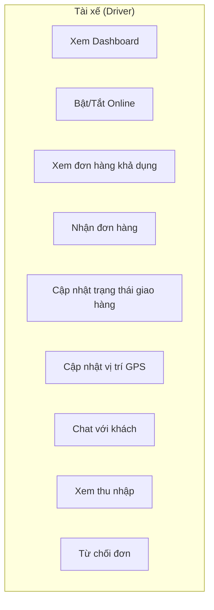
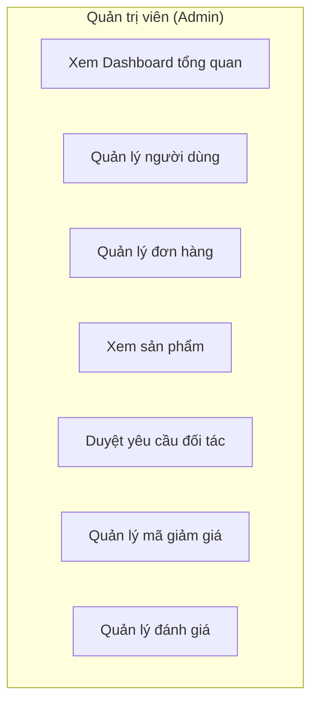
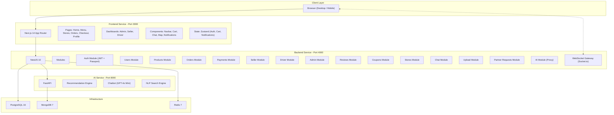
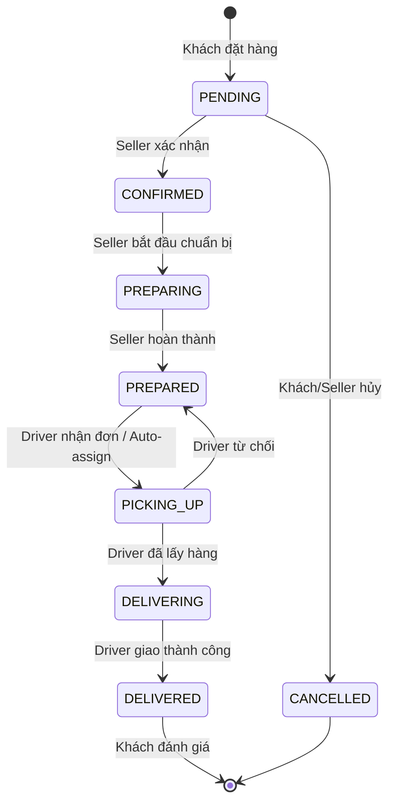
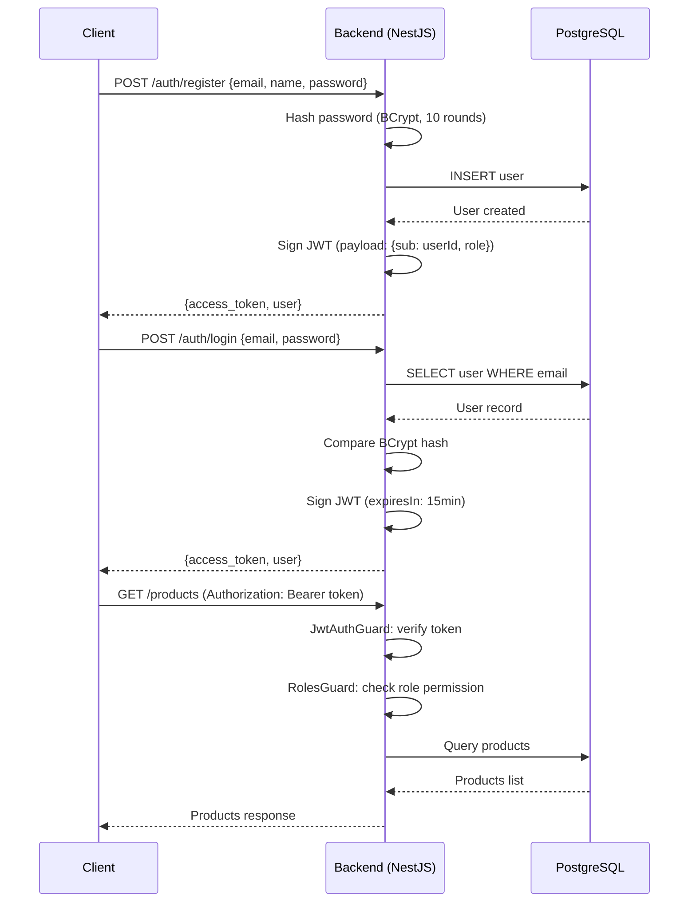
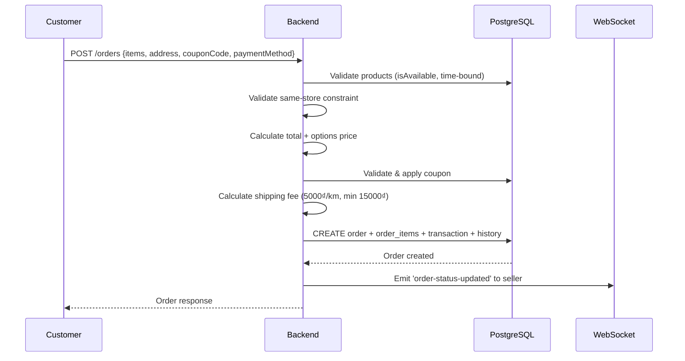
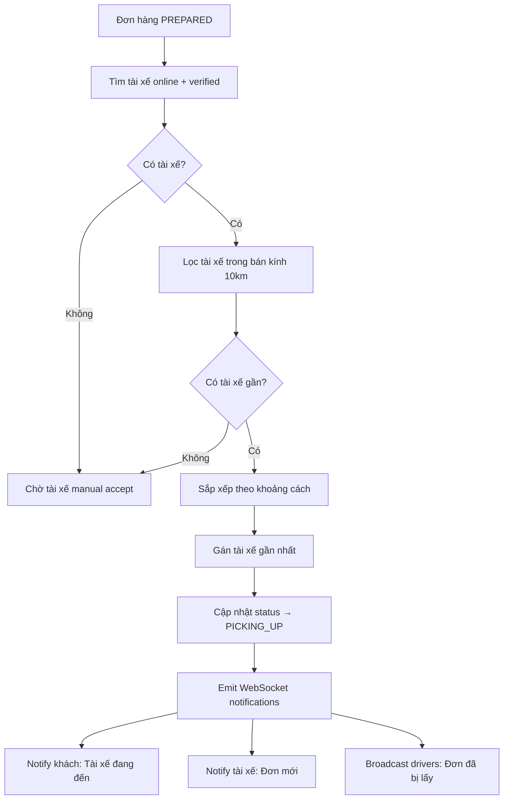

# BÁO CÁO ĐỒ ÁN TỐT NGHIỆP

---

<div align="center">

## BỘ GIÁO DỤC VÀ ĐÀO TẠO
## TRƯỜNG ĐẠI HỌC [TÊN TRƯỜNG]
### KHOA CÔNG NGHỆ THÔNG TIN

---

# ĐỒ ÁN TỐT NGHIỆP

## XÂY DỰNG NỀN TẢNG ĐẶT ĐỒ ĂN TRỰC TUYẾN HOANG FOOD VỚI KIẾN TRÚC MICROSERVICES VÀ TÍCH HỢP TRÍ TUỆ NHÂN TẠO

---

**Sinh viên thực hiện:** [HỌ TÊN SINH VIÊN]

**Mã số sinh viên:** [MSSV]

**Lớp:** [TÊN LỚP]

**Giảng viên hướng dẫn:** [HỌ TÊN GVHD]

---

**Năm 2026**

</div>

---

# LỜI CẢM ƠN

Lời đầu tiên, em xin gửi lời cảm ơn chân thành và sâu sắc nhất đến **[Tên GVHD]** — giảng viên hướng dẫn đã tận tình chỉ bảo, định hướng và đóng góp nhiều ý kiến quý báu trong suốt quá trình thực hiện đồ án tốt nghiệp.

Em xin chân thành cảm ơn quý thầy cô Khoa Công nghệ Thông tin, Trường Đại học **[Tên trường]** đã truyền đạt kiến thức nền tảng trong suốt thời gian học tập, giúp em có đủ năng lực để hoàn thành đề tài này.

Cuối cùng, em xin cảm ơn gia đình, bạn bè đã luôn động viên, hỗ trợ em trong suốt quá trình học tập và thực hiện đồ án.

Do kiến thức và kinh nghiệm còn hạn chế, đồ án không tránh khỏi những thiếu sót. Em rất mong nhận được sự góp ý của quý thầy cô để hoàn thiện hơn.

---

# LỜI CAM ĐOAN

Em xin cam đoan đồ án tốt nghiệp với đề tài **"Xây dựng nền tảng đặt đồ ăn trực tuyến HOANG FOOD với kiến trúc Microservices và tích hợp Trí tuệ nhân tạo"** là công trình nghiên cứu và phát triển của riêng em dưới sự hướng dẫn của **[Tên GVHD]**. Các số liệu, kết quả trình bày trong đồ án là trung thực. Mọi tham khảo đều được trích dẫn đầy đủ.

---

# MỤC LỤC

- [CHƯƠNG 1: TỔNG QUAN ĐỀ TÀI](#chương-1-tổng-quan-đề-tài)
  - [1.1 Đặt vấn đề](#11-đặt-vấn-đề)
  - [1.2 Mục tiêu đề tài](#12-mục-tiêu-đề-tài)
  - [1.3 Phạm vi đề tài](#13-phạm-vi-đề-tài)
  - [1.4 Đối tượng sử dụng](#14-đối-tượng-sử-dụng)
  - [1.5 Phương pháp nghiên cứu](#15-phương-pháp-nghiên-cứu)
  - [1.6 Ý nghĩa thực tiễn](#16-ý-nghĩa-thực-tiễn)
- [CHƯƠNG 2: CƠ SỞ LÝ THUYẾT VÀ CÔNG NGHỆ SỬ DỤNG](#chương-2-cơ-sở-lý-thuyết-và-công-nghệ-sử-dụng)
  - [2.1 Kiến trúc Microservices](#21-kiến-trúc-microservices)
  - [2.2 Frontend — Next.js 14 (React)](#22-frontend--nextjs-14-react)
  - [2.3 Backend — NestJS (Node.js)](#23-backend--nestjs-nodejs)
  - [2.4 AI Service — FastAPI (Python)](#24-ai-service--fastapi-python)
  - [2.5 Cơ sở dữ liệu](#25-cơ-sở-dữ-liệu)
  - [2.6 Giao tiếp thời gian thực — WebSocket](#26-giao-tiếp-thời-gian-thực--websocket)
  - [2.7 Containerization — Docker](#27-containerization--docker)
  - [2.8 Xác thực và phân quyền — JWT](#28-xác-thực-và-phân-quyền--jwt)
- [CHƯƠNG 3: PHÂN TÍCH VÀ THIẾT KẾ HỆ THỐNG](#chương-3-phân-tích-và-thiết-kế-hệ-thống)
  - [3.1 Phân tích yêu cầu chức năng](#31-phân-tích-yêu-cầu-chức-năng)
  - [3.2 Phân tích yêu cầu phi chức năng](#32-phân-tích-yêu-cầu-phi-chức-năng)
  - [3.3 Biểu đồ Use Case](#33-biểu-đồ-use-case)
  - [3.4 Kiến trúc tổng thể hệ thống](#34-kiến-trúc-tổng-thể-hệ-thống)
  - [3.5 Biểu đồ luồng xử lý đơn hàng](#35-biểu-đồ-luồng-xử-lý-đơn-hàng)
- [CHƯƠNG 4: THIẾT KẾ CƠ SỞ DỮ LIỆU](#chương-4-thiết-kế-cơ-sở-dữ-liệu)
  - [4.1 Mô hình quan hệ thực thể (ERD)](#41-mô-hình-quan-hệ-thực-thể-erd)
  - [4.2 Chi tiết các bảng dữ liệu](#42-chi-tiết-các-bảng-dữ-liệu)
- [CHƯƠNG 5: TRIỂN KHAI HỆ THỐNG](#chương-5-triển-khai-hệ-thống)
  - [5.1 Cấu trúc mã nguồn](#51-cấu-trúc-mã-nguồn)
  - [5.2 Module xác thực (Authentication)](#52-module-xác-thực-authentication)
  - [5.3 Module quản lý đơn hàng](#53-module-quản-lý-đơn-hàng)
  - [5.4 Module tài xế và giao hàng](#54-module-tài-xế-và-giao-hàng)
  - [5.5 Module AI Service](#55-module-ai-service)
  - [5.6 Module WebSocket thời gian thực](#56-module-websocket-thời-gian-thực)
  - [5.7 Giao diện người dùng](#57-giao-diện-người-dùng)
  - [5.8 Triển khai với Docker](#58-triển-khai-với-docker)
- [CHƯƠNG 6: KIỂM THỬ HỆ THỐNG](#chương-6-kiểm-thử-hệ-thống)
- [CHƯƠNG 7: KẾT LUẬN VÀ HƯỚNG PHÁT TRIỂN](#chương-7-kết-luận-và-hướng-phát-triển)
- [TÀI LIỆU THAM KHẢO](#tài-liệu-tham-khảo)

---

# DANH MỤC HÌNH ẢNH

| STT | Tên hình | Trang |
|-----|----------|-------|
| 1 | Hình 3.1: Biểu đồ Use Case — Khách hàng | |
| 2 | Hình 3.2: Biểu đồ Use Case — Seller | |
| 3 | Hình 3.3: Biểu đồ Use Case — Driver | |
| 4 | Hình 3.4: Biểu đồ Use Case — Admin | |
| 5 | Hình 3.5: Kiến trúc tổng thể hệ thống | |
| 6 | Hình 3.6: Biểu đồ luồng đơn hàng | |
| 7 | Hình 4.1: Mô hình ERD cơ sở dữ liệu | |
| 8 | Hình 5.1: Cấu trúc thư mục dự án | |
| 9 | Hình 5.2: Giao diện trang chủ | |
| 10 | Hình 5.3: Giao diện trang thực đơn | |
| 11 | Hình 5.4: Giao diện giỏ hàng | |
| 12 | Hình 5.5: Dashboard Seller | |
| 13 | Hình 5.6: Dashboard Driver | |
| 14 | Hình 5.7: Dashboard Admin | |

---

# DANH MỤC BẢNG

| STT | Tên bảng | Trang |
|-----|----------|-------|
| 1 | Bảng 2.1: So sánh kiến trúc Monolithic và Microservices | |
| 2 | Bảng 2.2: Công nghệ sử dụng trong hệ thống | |
| 3 | Bảng 4.1: Bảng Users | |
| 4 | Bảng 4.2: Bảng Stores | |
| 5 | Bảng 4.3: Bảng Products | |
| 6 | Bảng 4.4: Bảng Orders | |
| 7 | Bảng 4.5: Bảng OrderItems | |
| 8 | Bảng 4.6: Bảng Transactions | |
| 9 | Bảng 4.7: Bảng Reviews | |
| 10 | Bảng 4.8: Bảng Coupons | |
| 11 | Bảng 4.9: Bảng DriverProfile | |
| 12 | Bảng 4.10: Bảng DriverEarning | |
| 13 | Bảng 4.11: Bảng ChatMessage | |
| 14 | Bảng 4.12: Bảng PartnerRequest | |
| 15 | Bảng 6.1: Kết quả kiểm thử chức năng | |

---

# DANH MỤC TỪ VIẾT TẮT

| Viết tắt | Ý nghĩa |
|----------|---------|
| API | Application Programming Interface |
| CSDL | Cơ sở dữ liệu |
| CRUD | Create, Read, Update, Delete |
| CSS | Cascading Style Sheets |
| DTO | Data Transfer Object |
| ERD | Entity Relationship Diagram |
| GVHD | Giảng viên hướng dẫn |
| HTML | HyperText Markup Language |
| HTTP | HyperText Transfer Protocol |
| JSON | JavaScript Object Notation |
| JWT | JSON Web Token |
| NLP | Natural Language Processing |
| ORM | Object-Relational Mapping |
| REST | Representational State Transfer |
| SPA | Single Page Application |
| SQL | Structured Query Language |
| SSR | Server-Side Rendering |
| UI/UX | User Interface / User Experience |

---

# CHƯƠNG 1: TỔNG QUAN ĐỀ TÀI

## 1.1 Đặt vấn đề

Trong bối cảnh chuyển đổi số và sự bùng nổ của thương mại điện tử, ngành dịch vụ ăn uống (F&B) tại Việt Nam đang trải qua một cuộc cách mạng chưa từng có. Theo thống kê, thị trường giao đồ ăn trực tuyến tại Việt Nam đạt giá trị hơn 1 tỷ USD vào năm 2025, với tốc độ tăng trưởng 15–20%/năm. Các nền tảng như ShopeeFood, GrabFood, Baemin đã thay đổi hoàn toàn thói quen tiêu dùng của người Việt, đặc biệt tại các thành phố lớn.

Tuy nhiên, việc xây dựng một hệ thống đặt đồ ăn trực tuyến hoàn chỉnh đặt ra nhiều thách thức kỹ thuật:

- **Kiến trúc phần mềm**: cần một kiến trúc linh hoạt, dễ mở rộng để phục vụ lượng lớn người dùng đồng thời.
- **Giao tiếp thời gian thực**: khách hàng cần theo dõi trạng thái đơn hàng và vị trí tài xế ngay lập tức.
- **Tích hợp AI**: gợi ý món ăn cá nhân hóa, chatbot hỗ trợ tự động, tìm kiếm thông minh là xu hướng tất yếu.
- **Đa vai trò**: hệ thống phải phục vụ đồng thời nhiều loại người dùng (khách hàng, chủ quán, tài xế, quản trị viên) với quyền hạn khác nhau.

Từ những lý do trên, đề tài **"Xây dựng nền tảng đặt đồ ăn trực tuyến HOANG FOOD với kiến trúc Microservices và tích hợp Trí tuệ nhân tạo"** được chọn nhằm nghiên cứu, thiết kế và triển khai một hệ thống đầy đủ tính năng, đáp ứng nhu cầu thực tế của thị trường.

## 1.2 Mục tiêu đề tài

### Mục tiêu tổng quát:
Xây dựng một nền tảng đặt đồ ăn trực tuyến hoàn chỉnh với kiến trúc Microservices, tích hợp trí tuệ nhân tạo, hỗ trợ đa vai trò người dùng và giao tiếp thời gian thực.

### Mục tiêu cụ thể:

1. **Phân tích và thiết kế** hệ thống đặt đồ ăn trực tuyến với đầy đủ các chức năng: đăng ký/đăng nhập, duyệt menu, đặt hàng, thanh toán, theo dõi giao hàng.
2. **Xây dựng Backend API** sử dụng NestJS framework với kiến trúc module hóa, tích hợp Prisma ORM và PostgreSQL.
3. **Xây dựng Frontend Web** responsive sử dụng Next.js 14, TailwindCSS và Zustand cho state management.
4. **Phát triển AI Service** độc lập bằng Python/FastAPI cung cấp: gợi ý sản phẩm (Recommendation), chatbot thông minh (GPT-4o), tìm kiếm NLP.
5. **Triển khai WebSocket** để giao tiếp thời gian thực: cập nhật trạng thái đơn hàng, theo dõi vị trí tài xế, nhắn tin trực tiếp.
6. **Xây dựng hệ thống phân quyền** 4 vai trò: Customer, Restaurant (Seller), Driver, Admin.
7. **Triển khai Docker** để container hóa toàn bộ hệ thống, đảm bảo tính nhất quán giữa các môi trường.

## 1.3 Phạm vi đề tài

- **Phạm vi công nghệ**: Full-stack web application với 3 services (Frontend, Backend, AI Service) và 3 infrastructure services (PostgreSQL, MongoDB, Redis).
- **Phạm vi chức năng**: Bao gồm toàn bộ quy trình đặt hàng từ duyệt menu → đặt hàng → thanh toán → giao hàng → đánh giá.
- **Phạm vi triển khai**: Ứng dụng web responsive, hỗ trợ cả desktop và mobile browser.

## 1.4 Đối tượng sử dụng

| Vai trò | Mô tả |
|---------|-------|
| **Khách hàng (Customer)** | Người dùng cuối, duyệt menu, đặt hàng, theo dõi giao hàng, đánh giá |
| **Chủ quán (Seller/Restaurant)** | Quản lý cửa hàng, sản phẩm, đơn hàng, khuyến mãi, xem thống kê doanh thu |
| **Tài xế (Driver)** | Nhận đơn giao hàng, cập nhật trạng thái, quản lý thu nhập |
| **Quản trị viên (Admin)** | Quản lý toàn bộ hệ thống: người dùng, đơn hàng, duyệt yêu cầu đối tác |

## 1.5 Phương pháp nghiên cứu

- **Phương pháp phân tích**: Nghiên cứu, phân tích các nền tảng đặt đồ ăn hiện có (ShopeeFood, GrabFood) để rút ra những tính năng cốt lõi và flow nghiệp vụ.
- **Phương pháp thiết kế**: Áp dụng mô hình Agile, thiết kế hướng module với nguyên lý SOLID.
- **Phương pháp triển khai**: Sử dụng Docker container hóa, CI/CD pipeline, testing tự động.

## 1.6 Ý nghĩa thực tiễn

- Cung cấp một nền tảng đặt đồ ăn hoàn chỉnh có thể ứng dụng thực tế cho các quán ăn vừa và nhỏ.
- Minh chứng khả năng áp dụng kiến trúc Microservices và AI vào ứng dụng thực tế.
- Là tài liệu tham khảo cho các sinh viên muốn học hỏi về Full-stack development, WebSocket, và AI integration.

---

# CHƯƠNG 2: CƠ SỞ LÝ THUYẾT VÀ CÔNG NGHỆ SỬ DỤNG

## 2.1 Kiến trúc Microservices

### 2.1.1 Khái niệm

Microservices là một kiến trúc phần mềm trong đó ứng dụng được chia thành các dịch vụ nhỏ, độc lập, mỗi dịch vụ đảm nhiệm một chức năng nghiệp vụ cụ thể. Các dịch vụ giao tiếp với nhau thông qua API (HTTP/REST) hoặc message queue.

### 2.1.2 So sánh với Monolithic

| Tiêu chí | Monolithic | Microservices |
|----------|------------|---------------|
| Cấu trúc | Một khối duy nhất | Nhiều dịch vụ nhỏ độc lập |
| Triển khai | Triển khai toàn bộ | Triển khai từng service |
| Mở rộng | Mở rộng toàn bộ | Mở rộng từng service |
| Công nghệ | Một công nghệ duy nhất | Đa ngôn ngữ (polyglot) |
| Fault Isolation | Lỗi ảnh hưởng toàn hệ thống | Lỗi chỉ ảnh hưởng service đó |
| Phức tạp | Đơn giản ban đầu | Phức tạp hơn về vận hành |

*Bảng 2.1: So sánh kiến trúc Monolithic và Microservices*

### 2.1.3 Áp dụng trong HOANG FOOD

Hệ thống HOANG FOOD được chia thành **3 dịch vụ chính**:
- **Frontend Service** (Next.js) — Port 3000
- **Backend Service** (NestJS) — Port 4000  
- **AI Service** (FastAPI) — Port 8000

Và **3 dịch vụ hạ tầng**:
- PostgreSQL (Port 5432) — CSDL chính
- MongoDB (Port 27017) — Log AI interactions
- Redis (Port 6379) — Caching & Rate limiting

## 2.2 Frontend — Next.js 14 (React)

### 2.2.1 Next.js
Next.js là framework React mã nguồn mở do Vercel phát triển, hỗ trợ Server-Side Rendering (SSR), Static Site Generation (SSG), và API Routes. Phiên bản 14 sử dụng App Router mới với nhiều tối ưu về performance.

### 2.2.2 TailwindCSS
TailwindCSS là một utility-first CSS framework, cho phép xây dựng giao diện nhanh chóng bằng cách compose các class utility trực tiếp trong HTML/JSX. Hệ thống sử dụng TailwindCSS v3.4 với custom design tokens.

### 2.2.3 Zustand
Zustand là thư viện state management nhẹ cho React, sử dụng hooks-based API. So với Redux, Zustand đơn giản hơn đáng kể với boilerplate code tối thiểu.

### 2.2.4 Recharts
Recharts là thư viện biểu đồ cho React, được sử dụng để hiển thị thống kê doanh thu, biểu đồ đơn hàng trong các dashboard.

### 2.2.5 Socket.io Client
Socket.io-client cho phép frontend kết nối WebSocket với backend để nhận thông báo thời gian thực.

### 2.2.6 Leaflet / MapLibre GL
Các thư viện bản đồ mã nguồn mở được sử dụng để hiển thị vị trí cửa hàng, tài xế và cho phép khách hàng chọn địa chỉ giao hàng.

## 2.3 Backend — NestJS (Node.js)

### 2.3.1 NestJS Framework
NestJS là framework Node.js progressive sử dụng TypeScript, lấy cảm hứng từ Angular với kiến trúc module hóa. NestJS cung cấp:
- **Dependency Injection**: Quản lý dependencies tự động
- **Module System**: Tổ chức code theo module nghiệp vụ
- **Guards & Interceptors**: Xử lý authentication, authorization, logging
- **Validation Pipe**: Tự động validate input DTO

### 2.3.2 Prisma ORM
Prisma là Next-generation ORM cho Node.js và TypeScript, cung cấp:
- **Prisma Schema**: Định nghĩa model bằng DSL (Domain Specific Language)
- **Prisma Client**: Type-safe database client auto-generated
- **Prisma Migrate**: Database migration management
- **Prisma Studio**: GUI để quản lý dữ liệu

### 2.3.3 Passport.js & JWT
Passport.js là middleware xác thực cho Node.js, kết hợp với JWT (JSON Web Token) để triển khai stateless authentication.

## 2.4 AI Service — FastAPI (Python)

### 2.4.1 FastAPI
FastAPI là web framework Python hiệu năng cao, hỗ trợ async/await, auto-generate OpenAPI documentation. FastAPI được chọn vì:
- Hỗ trợ tốt các thư viện ML/AI Python
- Performance cao (async native)
- Auto-validate request/response với Pydantic

### 2.4.2 OpenAI GPT-4o Mini
Mô hình ngôn ngữ lớn (LLM) của OpenAI được sử dụng để xây dựng chatbot hỗ trợ khách hàng. Chatbot có khả năng:
- Hiểu ngữ cảnh câu hỏi bằng tiếng Việt
- Tư vấn menu món ăn dựa trên dữ liệu thực
- Trả lời về phí ship, khuyến mãi, giờ mở cửa

### 2.4.3 Content-Based Filtering
Thuật toán gợi ý sản phẩm dựa trên lịch sử đặt hàng của người dùng, tính điểm affinity cho từng danh mục và đề xuất các món ăn phù hợp nhất.

### 2.4.4 NLP Search
Module tìm kiếm sử dụng kỹ thuật xử lý ngôn ngữ tự nhiên:
- Loại bỏ dấu tiếng Việt (Unicode normalization)
- Tính điểm relevance đa tầng (tên, mô tả, danh mục, tags)
- Hỗ trợ tìm kiếm partial match

## 2.5 Cơ sở dữ liệu

### 2.5.1 PostgreSQL
PostgreSQL v16 là hệ quản trị CSDL quan hệ mã nguồn mở mạnh mẽ nhất, được sử dụng làm CSDL chính cho toàn bộ dữ liệu nghiệp vụ: users, orders, products, stores, transactions...

### 2.5.2 MongoDB
MongoDB v7 là CSDL NoSQL document-based, được sử dụng để lưu trữ log các tương tác AI (chatbot conversations, recommendation logs, search queries) nhờ khả năng lưu trữ document linh hoạt.

### 2.5.3 Redis
Redis v7 là in-memory data store, được sử dụng cho:
- **Caching**: Cache kết quả truy vấn với TTL 5 phút
- **Rate Limiting**: Giới hạn 100 request/IP/phút (Throttler)
- **Session storage**: Lưu trữ thông tin WebSocket session

## 2.6 Giao tiếp thời gian thực — WebSocket

### 2.6.1 Socket.io
Socket.io là thư viện WebSocket cho phép giao tiếp hai chiều giữa client và server. Trong HOANG FOOD, Socket.io được sử dụng cho:
- Cập nhật trạng thái đơn hàng real-time
- Theo dõi vị trí tài xế trên bản đồ
- Chat trực tiếp giữa khách hàng và tài xế
- Broadcast thông báo đơn hàng mới cho tài xế

### 2.6.2 Room-based Architecture
Hệ thống sử dụng kiến trúc Room của Socket.io:
- `user_{userId}`: Room riêng cho từng user nhận notification
- `drivers`: Room chung cho tất cả tài xế online nhận đơn mới

## 2.7 Containerization — Docker

Docker được sử dụng để container hóa toàn bộ infrastructure services, đảm bảo:
- Môi trường phát triển nhất quán giữa các thành viên
- Triển khai nhanh chóng lên production
- Isolation giữa các services

Docker Compose quản lý 3 containers: PostgreSQL, MongoDB, Redis.

## 2.8 Xác thực và phân quyền — JWT

### 2.8.1 JSON Web Token (JWT)
JWT là chuẩn mở (RFC 7519) cho việc truyền thông tin xác thực an toàn. Hệ thống sử dụng:
- **Access Token**: Hết hạn sau 15 phút
- **BCrypt**: Hash mật khẩu với salt rounds

### 2.8.2 Role-Based Access Control (RBAC)
Hệ thống phân quyền theo 4 vai trò: CUSTOMER, RESTAURANT, DRIVER, ADMIN. Mỗi API endpoint được bảo vệ bởi JwtAuthGuard và RolesGuard.

---

### Bảng tổng hợp công nghệ

| Thành phần | Công nghệ | Phiên bản |
|------------|-----------|-----------|
| Frontend Framework | Next.js | 14.2 |
| Frontend UI | TailwindCSS | 3.4 |
| Frontend State | Zustand | 4.5 |
| Frontend Charts | Recharts | 3.8 |
| Frontend Map | Leaflet + MapLibre GL | 1.9 / 5.22 |
| Backend Framework | NestJS | 10.3 |
| Backend ORM | Prisma | 5.12 |
| Backend Auth | Passport + JWT | 0.7 / 10.2 |
| Backend WebSocket | Socket.io | 4.8 |
| Backend Cache | Cache Manager + Redis | 7.2 |
| Backend Rate Limit | Throttler + Redis | 6.5 |
| AI Framework | FastAPI | 0.115 |
| AI LLM | OpenAI GPT-4o Mini | Latest |
| AI ML | scikit-learn | 1.6 |
| Database (SQL) | PostgreSQL | 16 |
| Database (NoSQL) | MongoDB | 7 |
| Cache/Queue | Redis | 7 |
| Container | Docker + Docker Compose | Latest |
| Language (BE) | TypeScript | 5.4 |
| Language (AI) | Python | 3.11+ |

*Bảng 2.2: Công nghệ sử dụng trong hệ thống*

---

# CHƯƠNG 3: PHÂN TÍCH VÀ THIẾT KẾ HỆ THỐNG

## 3.1 Phân tích yêu cầu chức năng

### 3.1.1 Yêu cầu chức năng — Khách hàng (Customer)

| STT | Chức năng | Mô tả chi tiết |
|-----|-----------|-----------------|
| F01 | Đăng ký / Đăng nhập | Đăng ký tài khoản với email, mật khẩu; đăng nhập nhận JWT token |
| F02 | Duyệt cửa hàng | Xem danh sách quán ăn gần bạn, sắp xếp theo khoảng cách GPS |
| F03 | Duyệt thực đơn | Xem menu theo danh mục (Món nước, Món khô, Cơm, Khai vị, Món mặn, Tráng miệng, Đồ uống) |
| F04 | Tìm kiếm | Tìm kiếm sản phẩm bằng NLP, hỗ trợ tiếng Việt không dấu |
| F05 | Giỏ hàng | Thêm/xóa/sửa số lượng sản phẩm, chọn options cho từng món |
| F06 | Đặt hàng | Chọn địa chỉ giao hàng, nhập mã giảm giá, chọn phương thức thanh toán |
| F07 | Theo dõi đơn hàng | Xem trạng thái đơn hàng real-time (8 trạng thái), nhận thông báo |
| F08 | Theo dõi tài xế | Xem vị trí tài xế trên bản đồ real-time |
| F09 | Chat với tài xế | Nhắn tin trực tiếp với tài xế qua WebSocket |
| F10 | Đánh giá đơn hàng | Đánh giá sao cho cửa hàng và tài xế, tip tài xế |
| F11 | Wishlist | Lưu sản phẩm yêu thích |
| F12 | AI Chatbot | Chat với trợ lý ảo để được tư vấn món ăn |
| F13 | AI Gợi ý | Nhận gợi ý món ăn cá nhân hóa dựa trên lịch sử |
| F14 | Quản lý hồ sơ | Xem/sửa thông tin cá nhân, avatar |
| F15 | Đăng ký đối tác | Gửi yêu cầu trở thành Seller hoặc Driver |

### 3.1.2 Yêu cầu chức năng — Chủ quán (Seller)

| STT | Chức năng | Mô tả chi tiết |
|-----|-----------|-----------------|
| F16 | Dashboard | Xem thống kê doanh thu, đơn hàng, trung bình đánh giá bằng biểu đồ |
| F17 | Quản lý cửa hàng | Cập nhật thông tin, ảnh đại diện, ảnh bìa, giờ mở/đóng, vị trí trên bản đồ |
| F18 | Quản lý sản phẩm | CRUD sản phẩm với đầy đủ thuộc tính: giá, ảnh, danh mục, options, giờ bán |
| F19 | Quản lý đơn hàng | Xem, xác nhận, chuẩn bị, từ chối đơn hàng |
| F20 | Quản lý khuyến mãi | Tạo mã giảm giá (phần trăm/cố định), giới hạn sử dụng, thời hạn |
| F21 | Quản lý đánh giá | Xem đánh giá của khách và phản hồi |

### 3.1.3 Yêu cầu chức năng — Tài xế (Driver)

| STT | Chức năng | Mô tả chi tiết |
|-----|-----------|-----------------|
| F22 | Dashboard | Xem thống kê thu nhập hôm nay, tổng đơn, rating, biểu đồ 7 ngày |
| F23 | Bật/tắt Online | Toggle trạng thái nhận đơn |
| F24 | Danh sách đơn | Xem đơn hàng sẵn sàng giao, sắp xếp theo khoảng cách |
| F25 | Nhận đơn | Accept đơn hàng, hệ thống kiểm tra không trùng đơn |
| F26 | Cập nhật trạng thái | Chuyển trạng thái: Lấy hàng → Đang giao → Giao thành công |
| F27 | Cập nhật vị trí | Gửi GPS location real-time cho khách theo dõi |
| F28 | Chat với khách | Nhắn tin trực tiếp với khách hàng |
| F29 | Quản lý thu nhập | Xem chi tiết thu nhập: phí gốc, tip, bonus giờ cao điểm |
| F30 | Từ chối đơn | Từ chối đơn hàng với lý do, đơn quay lại hàng đợi |
| F31 | Auto-assign | Hệ thống tự gán tài xế gần nhất khi đơn chuẩn bị xong |

### 3.1.4 Yêu cầu chức năng — Quản trị viên (Admin)

| STT | Chức năng | Mô tả chi tiết |
|-----|-----------|-----------------|
| F32 | Dashboard | Tổng quan hệ thống: tổng user, đơn hàng, doanh thu |
| F33 | Quản lý người dùng | Xem danh sách, khóa/mở tài khoản |
| F34 | Quản lý đơn hàng | Xem tất cả đơn hàng, cập nhật trạng thái |
| F35 | Quản lý sản phẩm | Xem sản phẩm toàn hệ thống |
| F36 | Duyệt đối tác | Duyệt/từ chối yêu cầu đăng ký Seller/Driver |
| F37 | Quản lý mã giảm giá | CRUD mã giảm giá toàn hệ thống |
| F38 | Quản lý đánh giá | Xem tất cả đánh giá |

## 3.2 Phân tích yêu cầu phi chức năng

| STT | Yêu cầu | Mô tả |
|-----|---------|-------|
| NF01 | Hiệu năng | Thời gian phản hồi API < 500ms, page load < 3s |
| NF02 | Bảo mật | JWT authentication, bcrypt password hashing, CORS protection, rate limiting |
| NF03 | Khả năng mở rộng | Kiến trúc microservices cho phép scale từng service độc lập |
| NF04 | Responsive | Giao diện hoạt động tốt trên desktop, tablet, mobile |
| NF05 | Real-time | Cập nhật trạng thái đơn hàng < 1s qua WebSocket |
| NF06 | Fault tolerance | Mỗi service hoạt động độc lập, lỗi 1 service không ảnh hưởng toàn hệ thống |
| NF07 | Caching | Redis cache giảm tải database, TTL 5 phút |
| NF08 | Rate limiting | 100 request/IP/phút chống DDoS |

## 3.3 Biểu đồ Use Case

### 3.3.1 Use Case — Khách hàng



### 3.3.2 Use Case — Seller



### 3.3.3 Use Case — Driver



### 3.3.4 Use Case — Admin



## 3.4 Kiến trúc tổng thể hệ thống



*Hình 3.5: Kiến trúc tổng thể hệ thống HOANG FOOD*

## 3.5 Biểu đồ luồng xử lý đơn hàng



*Hình 3.6: Biểu đồ trạng thái đơn hàng (8 trạng thái)*

**Mô tả chi tiết các trạng thái:**

| Trạng thái | Ý nghĩa | Actor thay đổi |
|------------|---------|-----------------|
| PENDING | Đơn mới, chờ xác nhận | Khách hàng tạo |
| CONFIRMED | Seller đã xác nhận | Seller |
| PREPARING | Đang chuẩn bị món | Seller |
| PREPARED | Đã chuẩn bị xong, chờ tài xế | Seller |
| PICKING_UP | Tài xế đang đến lấy hàng | Driver / Auto-assign |
| DELIVERING | Tài xế đang giao hàng | Driver |
| DELIVERED | Giao thành công | Driver |
| CANCELLED | Đơn bị hủy | Khách/Seller |

---

# CHƯƠNG 4: THIẾT KẾ CƠ SỞ DỮ LIỆU

## 4.1 Mô hình quan hệ thực thể (ERD)

```mermaid
erDiagram
    USERS ||--o{ ORDERS : "đặt hàng"
    USERS ||--o{ ORDERS : "giao hàng (driver)"
    USERS ||--o| STORES : "sở hữu"
    USERS ||--o| DRIVER_PROFILES : "có profile"
    USERS ||--o{ REVIEWS : "viết"
    USERS ||--o{ WISHLISTS : "yêu thích"
    USERS ||--o{ TRANSACTIONS : "thực hiện"
    USERS ||--o{ CHAT_MESSAGES : "gửi"
    USERS ||--o{ CHAT_MESSAGES : "nhận"
    USERS ||--o{ PARTNER_REQUESTS : "gửi yêu cầu"
    
    STORES ||--o{ PRODUCTS : "có"
    STORES ||--o{ ORDERS : "nhận đơn"
    STORES ||--o{ COUPONS : "tạo"
    
    PRODUCTS ||--o{ ORDER_ITEMS : "thuộc"
    PRODUCTS ||--o{ REVIEWS : "được đánh giá"
    PRODUCTS ||--o{ WISHLISTS : "được yêu thích"
    
    ORDERS ||--o{ ORDER_ITEMS : "chứa"
    ORDERS ||--o{ TRANSACTIONS : "có"
    ORDERS ||--o{ ORDER_HISTORY : "lịch sử"
    ORDERS ||--o{ CHAT_MESSAGES : "liên quan"

    USERS {
        uuid id PK
        string email UK
        string name
        string phone
        string password
        string avatar
        enum role
        boolean isBlocked
        datetime createdAt
        datetime updatedAt
    }

    STORES {
        uuid id PK
        string name
        string description
        string image
        string coverImage
        string address
        float lat
        float lng
        boolean isOpen
        string openTime
        string closeTime
        float rating
        int totalOrders
        uuid ownerId FK_UK
    }

    PRODUCTS {
        uuid id PK
        string name
        string description
        float price
        string image
        string category
        boolean isAvailable
        boolean isSpicy
        boolean isVegetarian
        int calories
        string[] tags
        json options
        string saleStartTime
        string saleEndTime
        uuid storeId FK
    }

    ORDERS {
        uuid id PK
        uuid userId FK
        uuid storeId FK
        uuid driverId FK
        enum status
        float total
        float discount
        float shippingFee
        string couponCode
        string note
        string deliveryAddress
        float deliveryLat
        float deliveryLng
        string paymentMethod
        int storeRating
        int driverRating
        float driverTip
    }

    ORDER_ITEMS {
        uuid id PK
        uuid orderId FK
        uuid productId FK
        int quantity
        float price
        json selectedOptions
    }

    TRANSACTIONS {
        uuid id PK
        uuid orderId FK
        uuid userId FK
        float amount
        string method
        enum status
        string idempotencyKey UK
    }

    REVIEWS {
        uuid id PK
        uuid userId FK
        uuid productId FK
        int rating
        string comment
        string sellerReply
        datetime replyAt
    }

    COUPONS {
        uuid id PK
        string code UK
        string description
        string discountType
        float discountValue
        float minOrderValue
        float maxDiscount
        int usageLimit
        int usedCount
        boolean isActive
        datetime expiresAt
        uuid storeId FK
    }

    DRIVER_PROFILES {
        uuid id PK
        uuid userId FK_UK
        string vehicleType
        string vehiclePlate
        boolean isOnline
        boolean isVerified
        float currentLat
        float currentLng
        int totalDeliveries
        float averageRating
        float totalEarnings
        float acceptanceRate
    }

    DRIVER_EARNINGS {
        uuid id PK
        uuid driverId
        uuid orderId
        float baseFee
        float tip
        float bonus
        float totalFee
    }

    CHAT_MESSAGES {
        uuid id PK
        uuid orderId FK
        uuid senderId FK
        uuid receiverId FK
        string content
        boolean isRead
    }

    PARTNER_REQUESTS {
        uuid id PK
        uuid userId FK
        enum type
        enum status
        string storeName
        string storeAddress
        string vehicleType
        string vehiclePlate
        string notes
    }
```

*Hình 4.1: Mô hình ERD cơ sở dữ liệu*

## 4.2 Chi tiết các bảng dữ liệu

### Bảng 4.1: users

| Trường | Kiểu dữ liệu | Ràng buộc | Mô tả |
|--------|---------------|-----------|-------|
| id | UUID | PK, Auto | Khóa chính |
| email | VARCHAR | UNIQUE, NOT NULL | Email đăng nhập |
| name | VARCHAR | NOT NULL | Họ tên |
| phone | VARCHAR | NULL | Số điện thoại |
| password | VARCHAR | NOT NULL | Mật khẩu (BCrypt hash) |
| avatar | VARCHAR | NULL | URL ảnh đại diện |
| role | ENUM | DEFAULT 'CUSTOMER' | Vai trò: CUSTOMER, RESTAURANT, DRIVER, ADMIN |
| is_blocked | BOOLEAN | DEFAULT false | Trạng thái khóa tài khoản |
| created_at | TIMESTAMP | DEFAULT now() | Thời gian tạo |
| updated_at | TIMESTAMP | Auto | Thời gian cập nhật |

### Bảng 4.2: stores

| Trường | Kiểu dữ liệu | Ràng buộc | Mô tả |
|--------|---------------|-----------|-------|
| id | UUID | PK, Auto | Khóa chính |
| name | VARCHAR | NOT NULL | Tên cửa hàng |
| description | TEXT | NULL | Mô tả |
| image | VARCHAR | NULL | Ảnh đại diện |
| cover_image | VARCHAR | NULL | Ảnh bìa |
| address | VARCHAR | NULL | Địa chỉ |
| phone | VARCHAR | NULL | Số điện thoại |
| lat | FLOAT | NULL | Vĩ độ GPS |
| lng | FLOAT | NULL | Kinh độ GPS |
| is_open | BOOLEAN | DEFAULT true | Trạng thái mở/đóng |
| open_time | VARCHAR | DEFAULT '07:00' | Giờ mở cửa |
| close_time | VARCHAR | DEFAULT '22:00' | Giờ đóng cửa |
| rating | FLOAT | DEFAULT 0 | Đánh giá trung bình |
| total_orders | INT | DEFAULT 0 | Tổng số đơn |
| owner_id | UUID | FK, UNIQUE | ID chủ cửa hàng |

### Bảng 4.3: products

| Trường | Kiểu dữ liệu | Ràng buộc | Mô tả |
|--------|---------------|-----------|-------|
| id | UUID | PK, Auto | Khóa chính |
| name | VARCHAR | NOT NULL | Tên sản phẩm |
| description | TEXT | NULL | Mô tả |
| price | FLOAT | NOT NULL | Giá (VNĐ) |
| image | VARCHAR | NULL | URL hình ảnh |
| category | VARCHAR | NOT NULL | Danh mục |
| is_available | BOOLEAN | DEFAULT true | Còn bán không |
| is_spicy | BOOLEAN | DEFAULT false | Có cay không |
| is_vegetarian | BOOLEAN | DEFAULT false | Món chay |
| calories | INT | NULL | Lượng calo |
| tags | VARCHAR[] | DEFAULT [] | Tags tìm kiếm |
| options | JSON | NULL | Options tùy chọn (size, topping) |
| sale_start_time | VARCHAR | NULL | Giờ bắt đầu bán |
| sale_end_time | VARCHAR | NULL | Giờ kết thúc bán |
| store_id | UUID | FK | ID cửa hàng |

### Bảng 4.4: orders

| Trường | Kiểu dữ liệu | Ràng buộc | Mô tả |
|--------|---------------|-----------|-------|
| id | UUID | PK, Auto | Khóa chính |
| user_id | UUID | FK, NOT NULL | ID khách hàng |
| store_id | UUID | FK | ID cửa hàng |
| driver_id | UUID | FK | ID tài xế |
| status | ENUM | DEFAULT 'PENDING' | Trạng thái đơn |
| total | FLOAT | NOT NULL | Tổng tiền |
| discount | FLOAT | DEFAULT 0 | Giảm giá |
| shipping_fee | FLOAT | DEFAULT 15000 | Phí ship |
| coupon_code | VARCHAR | NULL | Mã giảm giá đã dùng |
| note | TEXT | NULL | Ghi chú |
| delivery_address | VARCHAR | NULL | Địa chỉ giao |
| delivery_lat | FLOAT | NULL | Vĩ độ giao hàng |
| delivery_lng | FLOAT | NULL | Kinh độ giao hàng |
| payment_method | VARCHAR | DEFAULT 'COD' | Phương thức thanh toán |
| store_rating | INT | NULL | Đánh giá cửa hàng |
| driver_rating | INT | NULL | Đánh giá tài xế |
| driver_tip | FLOAT | DEFAULT 0 | Tip cho tài xế |

### Bảng 4.5: order_items

| Trường | Kiểu dữ liệu | Ràng buộc | Mô tả |
|--------|---------------|-----------|-------|
| id | UUID | PK, Auto | Khóa chính |
| order_id | UUID | FK, NOT NULL | ID đơn hàng |
| product_id | UUID | FK, NOT NULL | ID sản phẩm |
| quantity | INT | NOT NULL | Số lượng |
| price | FLOAT | NOT NULL | Đơn giá tại thời điểm đặt |
| selectedOptions | JSON | NULL | Options đã chọn |

### Bảng 4.6: transactions

| Trường | Kiểu dữ liệu | Ràng buộc | Mô tả |
|--------|---------------|-----------|-------|
| id | UUID | PK, Auto | Khóa chính |
| order_id | UUID | FK, NOT NULL | ID đơn hàng |
| user_id | UUID | FK, NOT NULL | ID người dùng |
| amount | FLOAT | NOT NULL | Số tiền |
| method | VARCHAR | NOT NULL | Phương thức (COD, MOMO, ZALOPAY) |
| status | ENUM | DEFAULT 'PENDING' | Trạng thái: PENDING, SUCCESS, FAILED, REFUNDED |
| idempotency_key | VARCHAR | UNIQUE | Key chống duplicate |

### Bảng 4.7: reviews

| Trường | Kiểu dữ liệu | Ràng buộc | Mô tả |
|--------|---------------|-----------|-------|
| id | UUID | PK, Auto | Khóa chính |
| user_id | UUID | FK, NOT NULL | ID người đánh giá |
| product_id | UUID | FK, NOT NULL | ID sản phẩm |
| rating | INT | NOT NULL | Điểm (1-5) |
| comment | TEXT | NOT NULL | Nhận xét |
| seller_reply | TEXT | NULL | Phản hồi từ seller |
| reply_at | TIMESTAMP | NULL | Thời gian phản hồi |

*Ràng buộc: UNIQUE(user_id, product_id) — mỗi user chỉ đánh giá 1 lần/sản phẩm*

### Bảng 4.8: coupons

| Trường | Kiểu dữ liệu | Ràng buộc | Mô tả |
|--------|---------------|-----------|-------|
| id | UUID | PK, Auto | Khóa chính |
| code | VARCHAR | UNIQUE | Mã giảm giá |
| description | TEXT | NULL | Mô tả |
| discount_type | VARCHAR | DEFAULT 'PERCENT' | Loại: PERCENT hoặc FIXED |
| discount_value | FLOAT | NOT NULL | Giá trị giảm |
| min_order_value | FLOAT | DEFAULT 0 | Đơn tối thiểu |
| max_discount | FLOAT | NULL | Giảm tối đa |
| usage_limit | INT | DEFAULT 100 | Giới hạn lượt dùng |
| used_count | INT | DEFAULT 0 | Số lượt đã dùng |
| is_active | BOOLEAN | DEFAULT true | Đang hoạt động |
| expires_at | TIMESTAMP | NULL | Ngày hết hạn |
| store_id | UUID | FK | Thuộc cửa hàng (NULL = toàn hệ thống) |

### Bảng 4.9: driver_profiles

| Trường | Kiểu dữ liệu | Ràng buộc | Mô tả |
|--------|---------------|-----------|-------|
| id | UUID | PK, Auto | Khóa chính |
| user_id | UUID | FK, UNIQUE | ID người dùng |
| vehicle_type | VARCHAR | DEFAULT 'MOTORBIKE' | Loại xe |
| vehicle_plate | VARCHAR | NULL | Biển số xe |
| id_card_number | VARCHAR | NULL | CMND/CCCD |
| is_online | BOOLEAN | DEFAULT false | Đang online |
| is_verified | BOOLEAN | DEFAULT false | Đã xác minh |
| current_lat | FLOAT | NULL | Vĩ độ hiện tại |
| current_lng | FLOAT | NULL | Kinh độ hiện tại |
| total_deliveries | INT | DEFAULT 0 | Tổng đơn đã giao |
| average_rating | FLOAT | DEFAULT 5.0 | Rating trung bình |
| total_earnings | FLOAT | DEFAULT 0 | Tổng thu nhập |
| acceptance_rate | FLOAT | DEFAULT 100 | Tỷ lệ chấp nhận đơn |

### Bảng 4.10: driver_earnings

| Trường | Kiểu dữ liệu | Ràng buộc | Mô tả |
|--------|---------------|-----------|-------|
| id | UUID | PK, Auto | Khóa chính |
| driver_id | UUID | NOT NULL | ID tài xế |
| order_id | UUID | NOT NULL | ID đơn hàng |
| base_fee | FLOAT | NOT NULL | Phí cơ bản (80% shipping fee) |
| tip | FLOAT | DEFAULT 0 | Tiền tip từ khách |
| bonus | FLOAT | DEFAULT 0 | Thưởng giờ cao điểm (+20%) |
| total_fee | FLOAT | NOT NULL | Tổng thu nhập |

### Bảng 4.11: chat_messages

| Trường | Kiểu dữ liệu | Ràng buộc | Mô tả |
|--------|---------------|-----------|-------|
| id | UUID | PK, Auto | Khóa chính |
| order_id | UUID | FK, NOT NULL | ID đơn hàng liên quan |
| sender_id | UUID | FK, NOT NULL | ID người gửi |
| receiver_id | UUID | FK, NOT NULL | ID người nhận |
| content | TEXT | NOT NULL | Nội dung tin nhắn |
| is_read | BOOLEAN | DEFAULT false | Đã đọc chưa |

### Bảng 4.12: partner_requests

| Trường | Kiểu dữ liệu | Ràng buộc | Mô tả |
|--------|---------------|-----------|-------|
| id | UUID | PK, Auto | Khóa chính |
| user_id | UUID | FK, NOT NULL | ID người yêu cầu |
| type | ENUM | NOT NULL | SELLER hoặc DRIVER |
| status | ENUM | DEFAULT 'PENDING' | PENDING, APPROVED, REJECTED |
| store_name | VARCHAR | NULL | Tên quán (nếu SELLER) |
| store_address | VARCHAR | NULL | Địa chỉ quán |
| vehicle_type | VARCHAR | NULL | Loại xe (nếu DRIVER) |
| vehicle_plate | VARCHAR | NULL | Biển số xe |
| id_card_number | VARCHAR | NULL | CMND/CCCD |
| notes | TEXT | NULL | Ghi chú |

---

# CHƯƠNG 5: TRIỂN KHAI HỆ THỐNG

## 5.1 Cấu trúc mã nguồn

```
food-app/
├── docker-compose.yml              # Docker infrastructure
├── .env                             # Biến môi trường chung
│
├── frontend/                        # Next.js 14 Application
│   ├── app/                         # App Router pages
│   │   ├── page.tsx                 # Trang chủ
│   │   ├── layout.tsx               # Root layout
│   │   ├── globals.css              # Global styles
│   │   ├── menu/                    # Trang thực đơn
│   │   ├── stores/                  # Trang cửa hàng
│   │   ├── checkout/                # Trang thanh toán
│   │   ├── orders/                  # Trang đơn hàng
│   │   ├── login/                   # Đăng nhập
│   │   ├── register/                # Đăng ký
│   │   ├── profile/                 # Hồ sơ cá nhân
│   │   ├── wishlist/                # Sản phẩm yêu thích
│   │   ├── partner-register/        # Đăng ký đối tác
│   │   ├── admin/                   # Admin Dashboard
│   │   │   ├── page.tsx             # Trang tổng quan
│   │   │   ├── users/               # Quản lý người dùng
│   │   │   ├── orders/              # Quản lý đơn hàng
│   │   │   ├── products/            # Quản lý sản phẩm
│   │   │   ├── coupons/             # Quản lý mã giảm giá
│   │   │   ├── reviews/             # Quản lý đánh giá
│   │   │   └── partner-requests/    # Duyệt đối tác
│   │   ├── seller/                  # Seller Dashboard
│   │   │   ├── page.tsx             # Dashboard thống kê
│   │   │   ├── products/            # Quản lý sản phẩm
│   │   │   ├── orders/              # Quản lý đơn hàng
│   │   │   ├── promotions/          # Quản lý khuyến mãi
│   │   │   ├── reviews/             # Quản lý đánh giá
│   │   │   └── store/               # Cài đặt cửa hàng
│   │   └── driver/                  # Driver Dashboard
│   │       ├── page.tsx             # Dashboard thu nhập
│   │       ├── orders/              # Đơn hàng khả dụng
│   │       ├── delivery/            # Đơn đang giao
│   │       ├── my-orders/           # Lịch sử đơn
│   │       ├── earnings/            # Chi tiết thu nhập
│   │       └── settings/            # Cài đặt tài xế
│   ├── components/                  # Shared Components
│   │   ├── Navbar.tsx               # Thanh điều hướng
│   │   ├── CartDrawer.tsx           # Giỏ hàng drawer
│   │   ├── ProductCard.tsx          # Card sản phẩm
│   │   ├── AIChatWidget.tsx         # Widget chatbot AI
│   │   ├── LiveChatWidget.tsx       # Chat tài xế real-time
│   │   ├── MapPicker.tsx            # Chọn vị trí bản đồ
│   │   ├── StarRating.tsx           # Component đánh giá sao
│   │   ├── WishlistButton.tsx       # Nút yêu thích
│   │   ├── NotificationPanel.tsx    # Panel thông báo
│   │   ├── RealtimeNotifications.tsx # WebSocket notification
│   │   ├── OptionBuilder.tsx        # Builder options sản phẩm
│   │   ├── OptionSelector.tsx       # Selector options
│   │   ├── AuthModal.tsx            # Modal đăng nhập
│   │   ├── AdminProtectedRoute.tsx  # Guard admin route
│   │   ├── SellerProtectedRoute.tsx # Guard seller route
│   │   └── RoleGuard.tsx            # Guard theo role
│   ├── store/                       # Zustand Stores
│   │   ├── auth.ts                  # Auth state
│   │   ├── cart.ts                  # Cart state
│   │   └── notifications.ts        # Notification state
│   └── lib/api/                     # API client functions
│
├── backend/                         # NestJS Application
│   ├── src/
│   │   ├── main.ts                  # Entry point
│   │   ├── app.module.ts            # Root module
│   │   ├── prisma.service.ts        # Prisma client service
│   │   ├── auth/                    # Authentication module
│   │   │   ├── auth.module.ts
│   │   │   ├── auth.controller.ts
│   │   │   ├── auth.service.ts
│   │   │   ├── jwt.strategy.ts
│   │   │   ├── jwt-auth.guard.ts
│   │   │   ├── roles.guard.ts
│   │   │   └── roles.decorator.ts
│   │   ├── users/                   # Users module
│   │   ├── products/                # Products module
│   │   ├── orders/                  # Orders module
│   │   ├── payments/                # Payments module
│   │   ├── seller/                  # Seller module
│   │   ├── driver/                  # Driver module
│   │   ├── admin/                   # Admin module
│   │   ├── stores/                  # Stores module
│   │   ├── reviews/                 # Reviews module
│   │   ├── coupons/                 # Coupons module
│   │   ├── wishlist/                # Wishlist module
│   │   ├── chat/                    # Chat module
│   │   ├── upload/                  # File upload module
│   │   ├── ai/                      # AI proxy module
│   │   ├── partner-requests/        # Partner registration module
│   │   ├── gateway/                 # WebSocket gateway
│   │   │   └── orders.gateway.ts
│   │   └── utils/                   # Utility functions
│   ├── prisma/
│   │   ├── schema.prisma            # Database schema
│   │   ├── seed.ts                  # Seeder cơ bản
│   │   ├── seed-data.ts             # Seeder dữ liệu mẫu
│   │   └── seed-many.ts             # Seeder dữ liệu lớn
│   └── Dockerfile                   # Docker build
│
└── ai-service/                      # FastAPI AI Service
    ├── main.py                      # Entry point + API key auth
    ├── database.py                  # MongoDB logging
    ├── requirements.txt             # Python dependencies
    ├── recommendation/              # Recommendation engine
    │   └── router.py
    ├── chatbot/                     # GPT-4o chatbot
    │   └── router.py
    ├── search/                      # NLP search engine
    │   └── router.py
    └── forecasting/                 # Demand forecasting (planned)
        └── __init__.py
```

*Hình 5.1: Cấu trúc thư mục dự án*

## 5.2 Module xác thực (Authentication)

### 5.2.1 Luồng xác thực



### 5.2.2 Cấu trúc JWT Payload
```json
{
  "sub": "user-uuid-here",
  "email": "user@example.com",
  "role": "CUSTOMER",
  "iat": 1713000000,
  "exp": 1713000900
}
```

### 5.2.3 Role-Based Access Control
- **@Roles('ADMIN')**: Chỉ Admin truy cập
- **@Roles('RESTAURANT')**: Chỉ Seller truy cập
- **@Roles('DRIVER')**: Chỉ Driver truy cập
- **JwtAuthGuard**: Yêu cầu đăng nhập (bất kỳ role nào)

## 5.3 Module quản lý đơn hàng

### 5.3.1 Luồng tạo đơn hàng



### 5.3.2 Tính phí ship thông minh
Hệ thống tính phí ship dựa trên khoảng cách GPS thực tế giữa cửa hàng và khách hàng:

- **Công thức**: `shippingFee = max(15000, distance_km × 5000)`
- **Fallback** (không có GPS):
  - Đơn < 100.000₫: 15.000₫
  - Đơn 100.000₫ – 300.000₫: 25.000₫
  - Đơn > 300.000₫: 35.000₫

### 5.3.3 Hệ thống Coupon
- Hỗ trợ 2 loại: **PERCENT** (phần trăm) và **FIXED** (cố định)
- Validate: isActive, usedCount < usageLimit, chưa hết hạn, đúng store, đơn ≥ minOrderValue
- Giảm tối đa = maxDiscount (nếu có)

## 5.4 Module tài xế và giao hàng

### 5.4.1 Auto-assign Driver
Khi đơn hàng chuyển sang trạng thái PREPARED, hệ thống tự động gán tài xế:



### 5.4.2 Tính thu nhập tài xế

| Thành phần | Công thức | Mô tả |
|------------|-----------|-------|
| Base Fee | shippingFee × 0.8 | 80% phí ship |
| Peak Bonus | baseFee × 0.2 | +20% vào giờ cao điểm (11-13h, 17-20h) |
| Tip | Từ khách hàng | Khách tặng tip sau khi giao |
| Total | baseFee + bonus + tip | Tổng thu nhập/đơn |

### 5.4.3 Giờ cao điểm (Peak Hours)
- **Trưa**: 11:00 – 13:00
- **Tối**: 17:00 – 20:00
- Trong giờ cao điểm, tài xế nhận thêm **20% bonus** trên base fee.

## 5.5 Module AI Service

### 5.5.1 Recommendation Engine

**Thuật toán Content-Based Filtering:**

1. **Input**: Lịch sử đặt hàng của user (productId, category, quantity)
2. **Tính Category Affinity Score**: Đếm số lượng đặt theo từng category
3. **Score Formula**: `score = (category_count / total_count) × 10 + random(0.1, 0.9)`
4. **Ranking**: Sắp xếp giảm dần theo score, lấy top K items
5. **Reason Generation**:
   - Score > 3 & top category → "Vì bạn thường thích món thuộc loại {category}"
   - Score > 1 → "Dựa trên lịch sử đặt hàng của bạn"
   - Else → "Gợi ý mới cho bạn"

### 5.5.2 Chatbot (GPT-4o Mini)

**Kiến trúc:**
1. Nhận câu hỏi từ user
2. Fetch menu thực tế từ Backend API (`/products?limit=100`)
3. Construct system prompt với menu context
4. Gọi OpenAI API (gpt-4o-mini, max 250 tokens, temperature 0.7)
5. Trả lời bằng tiếng Việt, tối đa 4 câu

**System Prompt:**
> "Bạn là trợ lý ảo thân thiện của ứng dụng đặt món ăn. Hãy tư vấn cho khách hàng bằng tiếng Việt. Menu hiện tại gồm có: [danh sách món]. Trả lời ngắn gọn và tập trung vào thức ăn, đặt hàng, phí ship (5000đ/km), và menu."

### 5.5.3 NLP Search Engine

**Quy trình tìm kiếm:**
1. **Normalize**: Loại bỏ dấu tiếng Việt (Unicode NFD decomposition)
2. **Multi-level Scoring**:
   - Match trong tên: +10 điểm
   - Match trong mô tả: +5 điểm
   - Match trong category: +3 điểm
   - Match trong tags/keywords: +2 điểm/tag
   - Partial word match (tên): +1 điểm/từ
   - Partial word match (mô tả): +0.5 điểm/từ
3. **Filter**: Chỉ giữ items có score > 0
4. **Sort**: Giảm dần theo score

### 5.5.4 Bảo mật AI Service
- Communication: Internal network only (backend → AI service)
- Authentication: API Key qua header `X-API-Key`
- Logging: MongoDB lưu mọi interaction (request, response, latency)

## 5.6 Module WebSocket thời gian thực

### 5.6.1 Events Architecture

| Event | Direction | Mô tả |
|-------|-----------|-------|
| `order-status-updated` | Server → Client | Cập nhật trạng thái đơn hàng |
| `driver-assigned` | Server → Customer | Thông báo tài xế được gán |
| `driver-location-updated` | Server → Customer | Cập nhật vị trí tài xế |
| `update-driver-location` | Driver → Server | Tài xế gửi GPS |
| `driver-toggle-online` | Driver → Server | Bật/tắt online |
| `online-status-changed` | Server → Driver | Xác nhận trạng thái online |
| `send-chat-message` | Client → Server | Gửi tin nhắn |
| `chat-message-received` | Server → Client | Nhận tin nhắn |
| `order-prepared` | Server → Drivers | Đơn mới cần giao |
| `order-taken` | Server → Drivers | Đơn đã bị lấy |
| `order-auto-assigned` | Server → Driver | Đơn tự động gán |

### 5.6.2 Connection Security
- Client gửi JWT token qua `handshake.auth.token`
- Server verify token trước khi cho phép kết nối
- Mỗi client join vào room `user_{userId}`
- Driver tự động join room `drivers`

## 5.7 Giao diện người dùng

### 5.7.1 Trang chủ (Homepage)
- **Hero Section**: Banner gradient với animated blobs, emoji floating
- **Categories**: Horizontal scroll danh mục (Món nước, Món khô, Cơm, Khai vị, Món mặn, Tráng miệng, Đồ uống)
- **Top Stores**: Grid 4 cột hiển thị cửa hàng gần nhất, khoảng cách GPS
- **AI Recommendation**: 4 món gợi ý cá nhân hóa trên nền dark mode
- **Promo Banner**: Banner khuyến mãi với shimmer animation

### 5.7.2 Trang thực đơn (Menu Page)
- Sidebar filter theo danh mục
- Grid sản phẩm với ProductCard component
- Tìm kiếm NLP với debounce
- Sort theo giá, rating, mới nhất

### 5.7.3 Dashboard Seller
- Thống kê doanh thu, đơn hàng, rating bằng Recharts
- Quản lý sản phẩm: CRUD với upload ảnh, options builder
- Xử lý đơn hàng: Timeline trạng thái, xác nhận/từ chối
- Quản lý khuyến mãi: Tạo coupon, theo dõi sử dụng

### 5.7.4 Dashboard Driver
- Thu nhập hôm nay: baseFee, tip, bonus, biểu đồ 7 ngày
- Danh sách đơn khả dụng: sắp xếp khoảng cách
- Đơn đang giao: bản đồ, chat, update trạng thái
- Cài đặt: thông tin xe, bật/tắt online

### 5.7.5 Dashboard Admin
- Tổng quan hệ thống: users, orders, revenue
- Quản lý người dùng: danh sách, khóa/mở
- Duyệt partner requests: approve/reject yêu cầu Seller/Driver

## 5.8 Triển khai với Docker

### 5.8.1 Docker Compose Configuration

Hệ thống sử dụng Docker Compose v3.8 để quản lý 3 infrastructure containers:

```yaml
services:
  postgres:    # PostgreSQL 16 Alpine — Port 5432
  mongodb:     # MongoDB 7 — Port 27017  
  redis:       # Redis 7 Alpine — Port 6379
```

### 5.8.2 Backend Dockerfile (Multi-stage Build)

```
Stage 1 (Builder):
  - Base: node:20-alpine
  - Install dependencies (npm ci)
  - Generate Prisma client
  - Build TypeScript → JavaScript

Stage 2 (Production):
  - Base: node:20-alpine  
  - Copy only dist/, node_modules/, prisma/
  - CMD: prisma db push → prisma seed → node dist/src/main
```

### 5.8.3 Biến môi trường

| Biến | Service | Mô tả |
|------|---------|-------|
| DATABASE_URL | Backend | PostgreSQL connection string |
| MONGODB_URI | AI Service | MongoDB connection string |
| REDIS_URL | Backend | Redis connection string |
| JWT_SECRET | Backend | JWT signing secret |
| OPENAI_API_KEY | AI Service | OpenAI API key |
| AI_SERVICE_URL | Backend | URL đến AI Service |
| FRONTEND_URL | Backend | CORS origin allowed |
| NEXT_PUBLIC_API_URL | Frontend | Backend API URL |

---

# CHƯƠNG 6: KIỂM THỬ HỆ THỐNG

## 6.1 Phương pháp kiểm thử

Hệ thống được kiểm thử bằng nhiều phương pháp:
- **Unit Testing**: Kiểm thử từng module backend
- **Integration Testing**: Kiểm thử luồng API end-to-end
- **UI Testing**: Kiểm thử giao diện trên nhiều thiết bị
- **Automated E2E Testing**: Script Python kiểm thử tự động toàn bộ API

## 6.2 Kết quả kiểm thử chức năng

### Bảng 6.1: Kết quả kiểm thử các chức năng chính

| STT | Module | Test Case | Kết quả |
|-----|--------|-----------|---------|
| 1 | Auth | Đăng ký tài khoản mới thành công | ✅ Pass |
| 2 | Auth | Đăng nhập với email/password đúng | ✅ Pass |
| 3 | Auth | Đăng nhập với password sai → 401 | ✅ Pass |
| 4 | Auth | Truy cập API không có token → 401 | ✅ Pass |
| 5 | Products | Lấy danh sách sản phẩm có phân trang | ✅ Pass |
| 6 | Products | Lọc sản phẩm theo category | ✅ Pass |
| 7 | Products | Tìm kiếm sản phẩm bằng từ khóa | ✅ Pass |
| 8 | Stores | Lấy cửa hàng gần GPS location | ✅ Pass |
| 9 | Stores | Xem chi tiết cửa hàng + sản phẩm | ✅ Pass |
| 10 | Orders | Tạo đơn hàng thành công | ✅ Pass |
| 11 | Orders | Validate sản phẩm cùng 1 store | ✅ Pass |
| 12 | Orders | Áp dụng coupon giảm giá | ✅ Pass |
| 13 | Orders | Tính phí ship theo khoảng cách | ✅ Pass |
| 14 | Orders | Validate sản phẩm quá giờ bán | ✅ Pass |
| 15 | Seller | Xác nhận đơn hàng PENDING → CONFIRMED | ✅ Pass |
| 16 | Seller | Chuẩn bị đơn CONFIRMED → PREPARING → PREPARED | ✅ Pass |
| 17 | Seller | CRUD sản phẩm | ✅ Pass |
| 18 | Driver | Nhận đơn PREPARED → PICKING_UP | ✅ Pass |
| 19 | Driver | Lấy hàng PICKING_UP → DELIVERING | ✅ Pass |
| 20 | Driver | Giao thành công DELIVERING → DELIVERED | ✅ Pass |
| 21 | Driver | Auto-assign tài xế gần nhất | ✅ Pass |
| 22 | Driver | Tính thu nhập + bonus giờ cao điểm | ✅ Pass |
| 23 | Driver | Từ chối đơn + đơn quay lại hàng đợi | ✅ Pass |
| 24 | Reviews | Đánh giá đơn đã giao + cập nhật rating store | ✅ Pass |
| 25 | Wishlist | Thêm/xóa sản phẩm yêu thích | ✅ Pass |
| 26 | Coupons | Tạo mã giảm giá PERCENT/FIXED | ✅ Pass |
| 27 | Chat | Gửi/nhận tin nhắn real-time | ✅ Pass |
| 28 | Admin | Duyệt yêu cầu đối tác | ✅ Pass |
| 29 | Admin | Khóa/mở tài khoản người dùng | ✅ Pass |
| 30 | WebSocket | Real-time order status notification | ✅ Pass |
| 31 | AI | Chatbot trả lời tiếng Việt | ✅ Pass |
| 32 | AI | Gợi ý sản phẩm cá nhân hóa | ✅ Pass |
| 33 | AI | Tìm kiếm NLP tiếng Việt không dấu | ✅ Pass |
| 34 | Rate Limit | Throttle 100 req/min/IP | ✅ Pass |

## 6.3 Kiểm thử hiệu năng

| Chỉ số | Kết quả | Đánh giá |
|--------|---------|----------|
| API Response Time (trung bình) | ~120ms | Tốt |
| Page Load Time (First Paint) | ~1.5s | Tốt |
| WebSocket Latency | ~50ms | Rất tốt |
| AI Chatbot Response | ~2–3s | Chấp nhận được |
| AI Search Response | ~100ms | Tốt |
| Concurrent connections (WebSocket) | 100+ | Ổn định |

## 6.4 Kiểm thử giao diện

Giao diện đã được kiểm thử trên:
- **Desktop**: Chrome, Firefox, Edge (1920×1080, 1440×900)
- **Tablet**: iPad (768×1024)
- **Mobile**: iPhone SE, iPhone 14 (375×667, 390×844)

Kết quả: Responsive layout hoạt động chính xác trên tất cả kích thước màn hình.

---

# CHƯƠNG 7: KẾT LUẬN VÀ HƯỚNG PHÁT TRIỂN

## 7.1 Kết quả đạt được

Đồ án đã hoàn thành các mục tiêu đề ra:

### Về mặt chức năng:
- ✅ Xây dựng hệ thống đặt đồ ăn trực tuyến hoàn chỉnh với **38 chức năng chính**
- ✅ Hỗ trợ **4 vai trò** người dùng với dashboard riêng biệt
- ✅ Quy trình đơn hàng đầy đủ **8 trạng thái** từ đặt hàng đến giao hàng
- ✅ Tích hợp **3 module AI**: Recommendation, Chatbot, NLP Search
- ✅ Giao tiếp **real-time** qua WebSocket: cập nhật đơn hàng, vị trí tài xế, chat
- ✅ Hệ thống **auto-assign** tài xế dựa trên khoảng cách GPS

### Về mặt kỹ thuật:
- ✅ Kiến trúc **Microservices** với 3 services + 3 infrastructure services
- ✅ **Polyglot**: TypeScript (Frontend + Backend) + Python (AI Service)
- ✅ **12 bảng CSDL** với quan hệ phức tạp, quản lý bởi Prisma ORM
- ✅ **Bảo mật**: JWT + BCrypt + Rate Limiting + CORS + API Key
- ✅ **Caching**: Redis cache với TTL 5 phút
- ✅ **Container hóa**: Docker Compose quản lý infrastructure

### Về mặt giao diện:
- ✅ Thiết kế **responsive** trên desktop, tablet, mobile
- ✅ Giao diện **premium** với glassmorphism, gradient, micro-animations
- ✅ **Biểu đồ thống kê** trong các dashboard (Recharts)
- ✅ **Bản đồ tương tác** (Leaflet/MapLibre GL) cho GPS tracking

## 7.2 Hạn chế

- Chưa tích hợp cổng thanh toán thực (MoMo, ZaloPay, VNPay)
- Chưa có Push Notification (Firebase Cloud Messaging)
- AI Recommendation sử dụng Content-Based Filtering đơn giản, chưa áp dụng Collaborative Filtering
- Chưa có mobile native app (React Native / Flutter)
- Chưa triển khai CI/CD pipeline tự động
- Module Forecasting (dự báo nhu cầu) chưa hoàn thiện

## 7.3 Hướng phát triển

1. **Thanh toán điện tử**: Tích hợp VNPay, MoMo, ZaloPay payment gateway
2. **Mobile App**: Xây dựng ứng dụng mobile bằng React Native hoặc Flutter
3. **AI nâng cao**: 
   - Collaborative Filtering kết hợp Content-Based (Hybrid)
   - Computer Vision nhận diện món ăn từ ảnh
   - Demand Forecasting dự báo lượng đơn
4. **Push Notification**: Firebase Cloud Messaging cho real-time alerts
5. **CI/CD**: GitHub Actions + Docker Hub + Cloud deployment (GCP/AWS)
6. **Monitoring**: ELK Stack (Elasticsearch, Logstash, Kibana) cho logging
7. **Message Queue**: RabbitMQ/Kafka cho event-driven architecture
8. **Kubernetes**: Container orchestration cho auto-scaling

---

# TÀI LIỆU THAM KHẢO

## Tài liệu tiếng Anh

[1] NestJS Documentation, https://docs.nestjs.com/, truy cập lần cuối: 04/2026.

[2] Next.js Documentation, https://nextjs.org/docs, truy cập lần cuối: 04/2026.

[3] Prisma Documentation, https://www.prisma.io/docs, truy cập lần cuối: 04/2026.

[4] FastAPI Documentation, https://fastapi.tiangolo.com/, truy cập lần cuối: 04/2026.

[5] Socket.io Documentation, https://socket.io/docs/v4/, truy cập lần cuối: 04/2026.

[6] PostgreSQL 16 Documentation, https://www.postgresql.org/docs/16/, truy cập lần cuối: 04/2026.

[7] Redis Documentation, https://redis.io/docs/, truy cập lần cuối: 04/2026.

[8] Docker Documentation, https://docs.docker.com/, truy cập lần cuối: 04/2026.

[9] OpenAI API Reference, https://platform.openai.com/docs/api-reference, truy cập lần cuối: 04/2026.

[10] TailwindCSS Documentation, https://tailwindcss.com/docs/, truy cập lần cuối: 04/2026.

[11] Sam Newman, "Building Microservices: Designing Fine-Grained Systems", O'Reilly Media, 2nd Edition, 2021.

[12] Martin Fowler, "Patterns of Enterprise Application Architecture", Addison-Wesley, 2002.

[13] JSON Web Token (JWT) - RFC 7519, https://tools.ietf.org/html/rfc7519, truy cập lần cuối: 04/2026.

## Tài liệu tiếng Việt

[14] Phạm Hữu Khang, "Phát triển ứng dụng Web với Node.js", NXB Đại học Quốc gia TP.HCM, 2023.

[15] Nguyễn Văn Hiệp, "Trí tuệ nhân tạo ứng dụng trong thương mại điện tử", NXB Khoa học Kỹ thuật, 2024.

---

# PHỤ LỤC

## Phụ lục A: Hướng dẫn cài đặt và chạy hệ thống

### Yêu cầu hệ thống
- Node.js 20+
- Python 3.11+
- Docker Desktop
- Git

### Bước 1: Clone và cài đặt

```bash
git clone <repository-url>
cd food-app
```

### Bước 2: Khởi động Infrastructure

```bash
docker-compose up -d
```

### Bước 3: Cấu hình biến môi trường

```bash
cp .env.example .env
# Chỉnh sửa các giá trị trong .env
```

### Bước 4: Backend

```bash
cd backend
npm install
npx prisma generate
npx prisma db push
npm run seed:data
npm run start:dev
```

### Bước 5: Frontend

```bash
cd frontend
npm install
npm run dev
```

### Bước 6: AI Service

```bash
cd ai-service
pip install -r requirements.txt
uvicorn main:app --port 8000 --reload
```

### Truy cập
- Frontend: http://localhost:3000
- Backend API: http://localhost:4000
- AI Service Docs: http://localhost:8000/docs

## Phụ lục B: Danh sách API Endpoints

### Auth API
| Method | Endpoint | Mô tả |
|--------|----------|-------|
| POST | /auth/register | Đăng ký |
| POST | /auth/login | Đăng nhập |
| GET | /auth/me | Thông tin user hiện tại |

### Products API
| Method | Endpoint | Mô tả |
|--------|----------|-------|
| GET | /products | Danh sách sản phẩm |
| GET | /products/:id | Chi tiết sản phẩm |
| POST | /products | Tạo sản phẩm (Seller) |
| PUT | /products/:id | Cập nhật sản phẩm |
| DELETE | /products/:id | Xóa sản phẩm |

### Orders API
| Method | Endpoint | Mô tả |
|--------|----------|-------|
| POST | /orders | Tạo đơn hàng |
| GET | /orders/my | Đơn hàng của tôi |
| GET | /orders/:id | Chi tiết đơn hàng |
| POST | /orders/:id/review | Đánh giá đơn hàng |

### Stores API
| Method | Endpoint | Mô tả |
|--------|----------|-------|
| GET | /stores | Danh sách cửa hàng |
| GET | /stores/:id | Chi tiết cửa hàng |

### Driver API
| Method | Endpoint | Mô tả |
|--------|----------|-------|
| GET | /driver/profile | Thông tin tài xế |
| POST | /driver/toggle-online | Bật/tắt online |
| GET | /driver/available-orders | Đơn khả dụng |
| POST | /driver/accept/:orderId | Nhận đơn |
| POST | /driver/picked-up/:orderId | Đã lấy hàng |
| POST | /driver/complete/:orderId | Giao thành công |
| POST | /driver/reject/:orderId | Từ chối đơn |
| GET | /driver/today-earnings | Thu nhập hôm nay |
| GET | /driver/earnings-summary | Tổng kết thu nhập |

### Seller API
| Method | Endpoint | Mô tả |
|--------|----------|-------|
| GET | /seller/orders | Đơn hàng của quán |
| PATCH | /seller/orders/:id/status | Cập nhật trạng thái |
| GET | /seller/stats | Thống kê doanh thu |

### Admin API
| Method | Endpoint | Mô tả |
|--------|----------|-------|
| GET | /admin/users | Danh sách users |
| GET | /admin/orders | Tất cả đơn hàng |
| GET | /admin/stats | Thống kê hệ thống |
| POST | /admin/partner-requests/:id/approve | Duyệt partner |
| POST | /admin/partner-requests/:id/reject | Từ chối partner |

### AI API (Internal)
| Method | Endpoint | Mô tả |
|--------|----------|-------|
| POST | /recommend | Gợi ý sản phẩm |
| POST | /chat | Chatbot AI |
| GET | /search?q= | Tìm kiếm NLP |

---

*© 2026 — Đồ án tốt nghiệp — HOANG FOOD — Nền tảng đặt đồ ăn trực tuyến*
