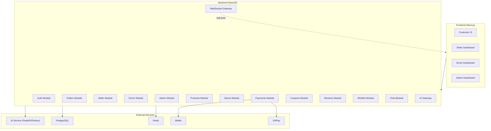
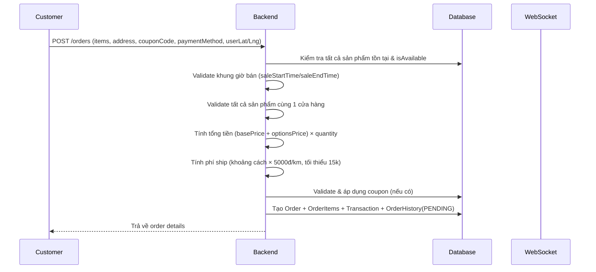
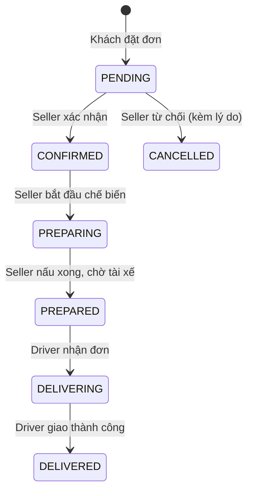
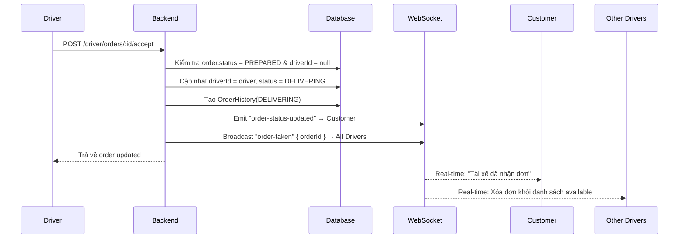
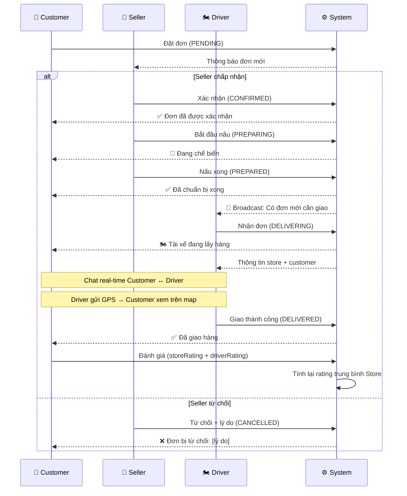
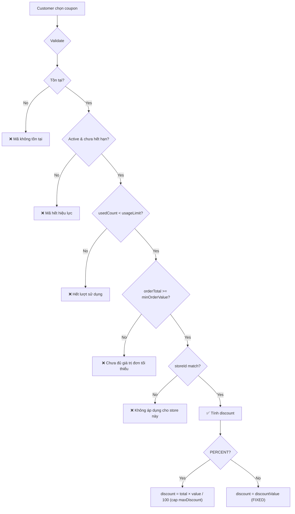
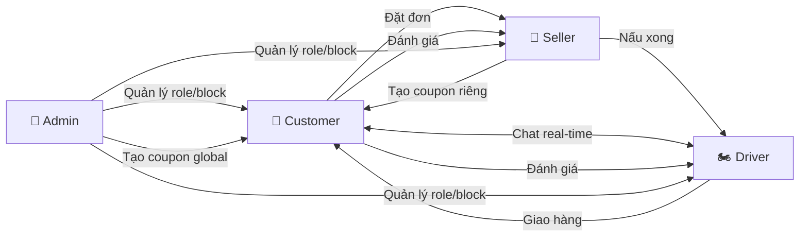

# HOANGFOOD — Tài liệu Logic Nghiệp vụ Toàn Hệ Thống

## Kiến trúc tổng quan



---

## Hệ thống Roles

Ứng dụng có **4 role**, mỗi role được gán cho User qua enum `Role`:

| Role | Mã | Mô tả |
|---|---|---|
| Khách hàng | `CUSTOMER` | Đặt đồ ăn, thanh toán, đánh giá |
| Chủ quán | `RESTAURANT` | Quản lý cửa hàng, sản phẩm, xử lý đơn |
| Tài xế | `DRIVER` | Nhận đơn, giao hàng |
| Quản trị | `ADMIN` | Quản lý toàn hệ thống |

Mặc định khi đăng ký → `CUSTOMER`. Admin có thể thay đổi role của bất kỳ user nào.

---

## 1. Xác thực & Phân quyền (Authentication & Authorization)

### Luồng Đăng ký
1. User gửi `POST /auth/register` với `{ name, email, password }`
2. Hệ thống kiểm tra email trùng → nếu trùng → `ConflictException`
3. Hash password bằng `bcrypt` (salt = 10)
4. Tạo User mới trong DB với role mặc định `CUSTOMER`
5. Sinh JWT token chứa `{ sub: userId, email, role }`
6. Trả về `{ user, accessToken }`

### Luồng Đăng nhập
1. User gửi `POST /auth/login` với `{ email, password }`
2. Tìm user theo email → không thấy → `UnauthorizedException`
3. So sánh password bằng `bcrypt.compare` → sai → `UnauthorizedException`
4. Sinh JWT token → trả về `{ user, accessToken }`

### Phân quyền (RBAC)
- Mọi route bảo vệ bởi `JwtAuthGuard` (xác thực token)
- Các route nhạy cảm thêm `RolesGuard` + decorator `@Roles(Role.XXX)`
- Guard đọc role từ JWT payload, so sánh với role yêu cầu → cho phép hoặc chặn
- Rate limiting toàn cục: **100 request/IP/phút**, riêng tạo đơn: **10 request/phút**

---

## 2. CUSTOMER — Khách hàng

### 2.1. Trang chủ — Duyệt sản phẩm

**Luồng:**
1. Frontend gọi `GET /products` (public, không cần auth)
2. Backend trả về danh sách sản phẩm `isAvailable = true` và đang trong khung giờ bán (`saleStartTime`/`saleEndTime`)
3. Hỗ trợ các bộ lọc:
   - `?search=xxx` → tìm theo tên/mô tả (case-insensitive)
   - `?vegetarian=true` → chỉ món chay
   - `?spicy=true/false` → lọc cay/không cay
   - `?maxCalories=500` → giới hạn calo
   - `?storeId=xxx` → lọc theo quán
4. Mỗi sản phẩm kèm `averageRating`, `totalReviews` (tính từ bảng Review)

### 2.2. Gợi ý món ăn (AI-Powered)

**Luồng:**
1. Frontend gọi `GET /products/recommended` (kèm token nếu đã đăng nhập)
2. Backend trích xuất `userId` từ token → lấy lịch sử đơn hàng
3. Gửi request tới **AI Service** (`POST /recommend`) với:
   - `userId`, `orderHistory` (sản phẩm đã mua + số lượng + danh mục)
   - `availableProducts` (danh sách món đang bán)
4. AI Service (Python/FastAPI) phân tích và trả về `[{ productId, score, reason }]`
5. Backend map lại thông tin sản phẩm đầy đủ + `recommendReason`
6. **Fallback:** Nếu AI lỗi/timeout (3.5s) → trả 4 sản phẩm mới nhất với lý do "Món phổ biến đang được yêu thích"

### 2.3. Khám phá cửa hàng (Geolocation)

**Luồng:**
1. Frontend lấy tọa độ GPS từ trình duyệt (`navigator.geolocation`)
2. Gọi `GET /stores?lat=xxx&lng=xxx&radius=10`
3. Backend chạy **raw SQL với công thức Haversine** để tính khoảng cách thực tế
4. Trả về danh sách cửa hàng đang mở (`isOpen = true`) trong bán kính (mặc định 10km), sắp xếp theo khoảng cách gần nhất
5. Nếu không có tọa độ → trả tất cả cửa hàng đang mở, sắp xếp theo rating

### 2.4. Xem chi tiết cửa hàng

**Luồng:**
1. Gọi `GET /stores/:id`
2. Trả về thông tin quán + danh sách sản phẩm available (lọc thêm theo khung giờ bán)

### 2.5. Giỏ hàng & Biến thể sản phẩm (Options/Variants)

**Logic quan trọng:**
- Sản phẩm có trường `options` (JSON) lưu cấu trúc nhóm tùy chọn:
  ```
  [{ name: "Size", isRequired: true, isMultiple: false, 
     choices: [{ name: "M", price: 0 }, { name: "L", price: 10000 }] }]
  ```
- Khi thêm vào giỏ, `selectedOptions` được lưu kèm → **2 item cùng sản phẩm nhưng khác options = 2 dòng riêng**
- Giá cuối = `basePrice + tổng giá options` × quantity

### 2.6. Đặt hàng (Create Order)

**Luồng chi tiết:**



**Quy tắc nghiệp vụ:**
1. **Cùng cửa hàng:** Tất cả sản phẩm trong 1 đơn phải thuộc cùng 1 store → nếu không → lỗi
2. **Kiểm tra thời gian:** Sản phẩm ngoài giờ bán → lỗi, kèm tên sản phẩm
3. **Phí ship:**
   - Nếu có tọa độ user + store → `khoảng cách (km) × 5000đ`, tối thiểu 15.000đ
   - Nếu không có tọa độ → theo tổng đơn: <100k→15k, <300k→25k, ≥300k→35k
4. **Coupon:** Validate active + chưa hết hạn + chưa đạt `usageLimit` + đủ `minOrderValue` + đúng store (nếu coupon gắn store) → tính discount theo PERCENT hoặc FIXED → cập nhật `usedCount`
5. **Tổng cuối:** `total + shippingFee - discount`
6. **Transaction:** Tạo record thanh toán với `idempotencyKey` (UUID) để chống duplicate

### 2.7. Thanh toán

**Các phương thức:**
- `COD` — Thanh toán khi nhận hàng (mặc định)
- `MOMO` — Thanh toán qua MoMo: `POST /payments/momo/create` → tạo link thanh toán → redirect user → callback `POST /payments/momo/callback`
- `VNPAY` — Thanh toán qua VNPay: `POST /payments/vnpay/create` → redirect → callback `GET /payments/vnpay/callback`

### 2.8. Theo dõi đơn hàng (Real-time)

**Luồng:**
1. Frontend kết nối WebSocket với JWT token
2. Server verify token → join user vào room `user_{userId}`
3. Mỗi khi trạng thái đơn thay đổi → server emit `order-status-updated` tới room của customer
4. Driver gửi tọa độ GPS qua event `update-driver-location` → server forward tới customer qua `driver-location-updated`

### 2.9. Chat với tài xế (Real-time)

**Luồng:**
1. Khi đơn đang `DELIVERING`, customer và driver có thể chat
2. Client gửi event `send-chat-message` qua WebSocket: `{ orderId, receiverId, content }`
3. Server validate: sender phải là `order.userId` hoặc `order.driverId`, receiver tương tự
4. Lưu tin nhắn vào DB (`ChatMessage`)
5. Emit `chat-message-received` tới cả sender và receiver
6. Lịch sử chat: `GET /chat/orders/:id` (REST API)

### 2.10. Đánh giá đơn hàng

**Luồng:**
1. Đơn hàng phải ở trạng thái `DELIVERED`
2. Customer gửi `POST /orders/:id/review` với `{ storeRating, driverRating, reviewComment }`
3. Mỗi đơn chỉ đánh giá **1 lần** (check `storeRating !== null`)
4. Sau khi đánh giá → hệ thống **tính lại rating trung bình** của cửa hàng từ tất cả đơn có `storeRating`
5. Cập nhật `store.rating` (Float, 1 decimal)

### 2.11. Review sản phẩm

**Khác với đánh giá đơn hàng:**
- `POST /reviews` với `{ productId, rating (1-5), comment }`
- Mỗi user chỉ review 1 product **1 lần** (unique constraint `userId + productId`)

### 2.12. Wishlist (Yêu thích)

- `GET /wishlist` → danh sách sản phẩm yêu thích
- `POST /wishlist/:productId` → thêm (idempotent, không lỗi nếu đã có)
- `DELETE /wishlist/:productId` → xóa

### 2.13. Coupon picker

- `GET /coupons?storeId=xxx` → danh sách coupon đang active, chưa hết hạn, áp dụng được cho store hiện tại
- `POST /coupons/validate` → validate coupon trước khi checkout: kiểm tra tồn tại, active, hạn, lượt dùng, min order, store match → trả preview discount

---

## 3. RESTAURANT (Seller) — Chủ quán

> Toàn bộ route seller bảo vệ bởi `@Roles(Role.RESTAURANT)`

### 3.1. Quản lý cửa hàng

**Mỗi user RESTAURANT sở hữu đúng 1 store** (quan hệ 1-1 qua `ownerId`).

- `GET /seller/store` → thông tin cửa hàng của mình
- `PATCH /seller/store` → cập nhật: name, description, image, coverImage, address, phone, lat, lng, openTime, closeTime
- `PATCH /seller/store/toggle` → bật/tắt cửa hàng (`isOpen` toggle)
- Seller có thể set tọa độ GPS qua Leaflet map + Goong Maps geocoding

### 3.2. Quản lý sản phẩm

- `GET /seller/products` → danh sách sản phẩm của store kèm `_count.orderItems` và `_count.reviews`
- `POST /seller/products` → tạo sản phẩm mới: name, description, price, image, category, isSpicy, isVegetarian, calories, tags[], saleStartTime, saleEndTime, options (JSON variants)
- `PATCH /seller/products/:id` → cập nhật sản phẩm (phải thuộc store của mình)
- `PATCH /seller/products/:id/toggle` → bật/tắt `isAvailable`
- `DELETE /seller/products/:id`:
  - **Nếu sản phẩm đã từng có order** → KHÔNG xóa, chỉ set `isAvailable = false` (soft delete, bảo toàn dữ liệu lịch sử)
  - **Nếu chưa có order** → xóa hoàn toàn (hard delete)

### 3.3. Quản lý đơn hàng

**Luồng xử lý đơn của Seller:**



**API:**
- `GET /seller/orders` → tất cả đơn của store, kèm thông tin customer (name, email, phone) và items
- `PATCH /seller/orders/:id/status` → chuyển trạng thái, với validation:
  - Chỉ được chuyển **tiến lên phía trước** (PENDING→CONFIRMED→PREPARING→PREPARED)
  - **KHÔNG ĐƯỢC** chuyển sang DELIVERING hoặc DELIVERED (quyền của Driver)
  - **KHÔNG ĐƯỢC** quay ngược trạng thái
- `PATCH /seller/orders/:id/reject` → từ chối đơn, kèm lý do. Chỉ từ chối được khi `PENDING`

**Khi trạng thái = PREPARED:**
- Server broadcast event `order-prepared` tới room `drivers` qua WebSocket
- Payload: `{ orderId, store info, total, shippingFee }`
- → Tất cả driver online đều nhận được thông báo có đơn mới cần giao

### 3.4. Quản lý Coupon

- `GET /coupons/seller` → danh sách coupon của store mình
- `POST /coupons/seller` → tạo coupon mới: code, description, discountType (PERCENT/FIXED), discountValue, minOrderValue, maxDiscount, usageLimit, expiresAt → **tự động gắn storeId**
- `DELETE /coupons/seller/:id` → xóa coupon (phải thuộc store mình)

### 3.5. Quản lý Review

- `GET /reviews/seller` → tất cả review về sản phẩm của store mình
- `PATCH /reviews/:id/reply` → seller phản hồi review: lưu `sellerReply` + `replyAt`

### 3.6. Thống kê (Dashboard Stats)

`GET /seller/stats` trả về:
- `ordersToday` — số đơn hôm nay
- `revenueToday` — doanh thu hôm nay
- `totalProducts` — tổng số sản phẩm
- `averageRating` — rating trung bình store
- `totalOrders` — tổng số đơn lịch sử
- `chartData[]` — biểu đồ 7 ngày gần nhất: `{ date, orders, revenue }`
- `topProducts[]` — top 5 sản phẩm bán chạy nhất: `{ name, totalSold }`

---

## 4. DRIVER — Tài xế

> Toàn bộ route driver bảo vệ bởi `@Roles(Role.DRIVER)`

### 4.1. Kết nối WebSocket

1. Driver đăng nhập → frontend kết nối WebSocket với JWT
2. Server detect `role = DRIVER` → tự động join room `drivers`
3. Driver nhận real-time notification mỗi khi có đơn `PREPARED`

### 4.2. Xem đơn hàng khả dụng

- `GET /driver/available-orders` → danh sách đơn có `status = PREPARED` và `driverId = null`
- Mỗi đơn kèm thông tin store (name, address, phone) và customer (id, name, phone)
- Sắp xếp theo `updatedAt ASC` (đơn cũ nhất ưu tiên)

### 4.3. Nhận đơn (Accept Order)

**Luồng:**



**Quy tắc:**
- **First-come-first-served:** Driver đầu tiên gọi API accept → nhận đơn
- Nếu đơn đã được nhận bởi driver khác → `BadRequestException`
- Sau khi nhận → broadcast `order-taken` để các driver khác xóa đơn ra khỏi UI

### 4.4. Hoàn thành giao hàng

- `PATCH /driver/orders/:id/complete`
- Validate: đơn phải thuộc driver này (`driverId = req.user.id`) và `status = DELIVERING`
- Chuyển status → `DELIVERED`
- Emit `order-status-updated` → customer biết đã giao thành công

### 4.5. Lịch sử đơn hàng

- `GET /driver/orders/my-orders` → tất cả đơn driver đã nhận (cả đang giao và đã giao)

### 4.6. Cập nhật vị trí GPS (Real-time)

- Driver gửi event `update-driver-location` qua WebSocket: `{ orderId, customerId, lat, lng }`
- Server forward tới room của customer → hiển thị vị trí tài xế trên bản đồ real-time

### 4.7. Chat với khách hàng

- Sử dụng cùng hệ thống chat WebSocket như Customer (mục 2.9)
- Driver gửi/nhận tin nhắn qua event `send-chat-message` / `chat-message-received`

---

## 5. ADMIN — Quản trị viên

> Toàn bộ route admin bảo vệ bởi `@Roles(Role.ADMIN)`

### 5.1. Dashboard Thống kê

`GET /admin/stats` trả về:
- `totalOrders` — tổng số đơn toàn hệ thống
- `revenueToday` — doanh thu hôm nay (tổng `total` các đơn từ 00:00)
- `totalUsers` — tổng số user
- `totalProducts` — tổng số sản phẩm
- `chartData[]` — biểu đồ 7 ngày: `{ date, orders, revenue }`

### 5.2. Quản lý đơn hàng

- `GET /admin/orders` → tất cả đơn, kèm user info và items
- `PATCH /orders/:id/status` → admin có thể đổi trạng thái bất kỳ đơn nào (chỉ ADMIN mới được dùng route `/orders/:id/status`)

### 5.3. Quản lý sản phẩm

- `GET /admin/products` → xem tất cả sản phẩm (view-only, admin không tạo/sửa sản phẩm)

### 5.4. Quản lý người dùng

- `GET /admin/users?role=xxx&blocked=true/false` → lọc user theo role và trạng thái bị chặn
- `PATCH /admin/users/:id/role` → **thay đổi role** của user (ví dụ: CUSTOMER → RESTAURANT, CUSTOMER → DRIVER)
- `PATCH /admin/users/:id/block` → **chặn/mở chặn** user (`isBlocked = true/false`)

### 5.5. Quản lý Coupon (toàn hệ thống)

- `GET /coupons/admin` → tất cả coupon
- `POST /coupons` → tạo coupon global (không gắn storeId) → áp dụng cho mọi cửa hàng
- `DELETE /coupons/:id` → xóa bất kỳ coupon nào

### 5.6. Quản lý Review

- `GET /reviews/admin` → tất cả review toàn hệ thống
- `DELETE /reviews/:id` → xóa review vi phạm

---

## 6. Luồng đơn hàng End-to-End (Order Lifecycle)



### Bảng trạng thái chi tiết

| Trạng thái | Ai thực hiện | Ý nghĩa | Ai thấy |
|---|---|---|---|
| `PENDING` | System (khi customer đặt) | Đơn mới, chờ seller xác nhận | Customer, Seller |
| `CONFIRMED` | Seller | Seller chấp nhận đơn | Customer |
| `PREPARING` | Seller | Đang chế biến | Customer |
| `PREPARED` | Seller | Nấu xong, chờ tài xế | Customer, All Drivers |
| `DELIVERING` | Driver (nhận đơn) | Tài xế đang lấy hàng & giao | Customer |
| `DELIVERED` | Driver (hoàn thành) | Giao hàng thành công | Customer |
| `CANCELLED` | Seller (từ chối) hoặc Admin | Đơn bị hủy | Customer |

---

## 7. Hệ thống Real-time (WebSocket)

### Kết nối
- Client kết nối với JWT token qua `socket.io`
- Server verify → join room `user_{userId}`
- Driver → thêm join room `drivers`

### Events

| Event | Hướng | Mô tả |
|---|---|---|
| `order-status-updated` | Server → Customer | Cập nhật trạng thái đơn `{ orderId, status, note }` |
| `order-prepared` | Server → All Drivers | Có đơn mới cần giao `{ orderId, store, total }` |
| `order-taken` | Server → All Drivers | Đơn đã được driver khác nhận `{ orderId }` |
| `update-driver-location` | Driver → Server | GPS tài xế `{ orderId, customerId, lat, lng }` |
| `driver-location-updated` | Server → Customer | Vị trí tài xế real-time `{ orderId, lat, lng }` |
| `send-chat-message` | Client → Server | Gửi tin nhắn `{ orderId, receiverId, content }` |
| `chat-message-received` | Server → Sender + Receiver | Tin nhắn đã lưu, hiển thị real-time |

---

## 8. AI Service (Python/FastAPI)

Microservice riêng biệt, giao tiếp với Backend qua HTTP + API Key.

| Endpoint | Chức năng |
|---|---|
| `POST /recommend` | Gợi ý món ăn dựa trên lịch sử mua |
| `POST /chat` | Chatbot hỗ trợ khách hàng (AI) |
| `POST /search` | Tìm kiếm ngữ nghĩa NLP |
| `GET /health` | Health check |

### Bảo mật
- Xác thực bằng header `X-API-KEY`
- Chỉ nhận request từ Backend (internal network)

---

## 9. Hệ thống Coupon



**2 loại coupon:**
- **Global** (Admin tạo, `storeId = null`) → áp dụng mọi store
- **Store-specific** (Seller tạo, `storeId = store.id`) → chỉ áp dụng cho store đó

---

## 10. Profile & Upload

- `PATCH /users/profile` → cập nhật name, phone, avatar
- `POST /upload` → upload ảnh lên server → lưu tại `public/uploads/` → trả về URL path
- Avatar hiển thị trên Navbar cho tất cả roles

---

## Tổng kết tương tác liên Role


